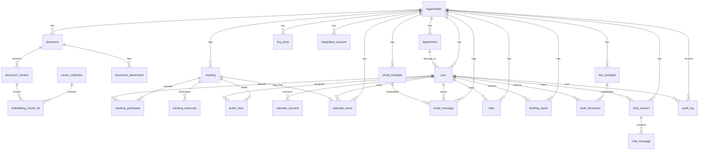

```mermaid
erDiagram
  %% 조직/사용자
  organization ||--o{ department : has
  organization ||--o{ user : has
  department   ||--o{ user : belongs_to

  %% 문서/버전/임베딩
  organization     ||--o{ document : has
  document         ||--o{ document_version : versions
  document         ||--o{ document_attachment : files
  vector_collection||--o{ embedding_chunk_ref : contains
  document_version ||--o{ embedding_chunk_ref : chunks

  %% 회의
  organization     ||--o{ meeting : has
  meeting          ||--o{ meeting_participant : includes
  meeting          ||--o{ meeting_transcript : transcripts
  meeting          ||--o{ action_item : yields
  user             ||--o{ meeting_participant : attends
  user             ||--o{ action_item : assigned

  %% 일정
  user             ||--o{ calendar_account : connects
  organization     ||--o{ calendar_event : has
  user             ||--o{ calendar_event : owns
  meeting          ||--o| calendar_event : may_link

  %% 이메일
  organization     ||--o{ email_template : has
  organization     ||--o{ email_message : logs
  user             ||--o{ email_message : sends
  email_template   ||--o{ email_message : instantiates

  %% To-Do/브리핑
  organization     ||--o{ todo : has
  user             ||--o{ todo : owns
  organization     ||--o{ briefing_report : has
  user             ||--o{ briefing_report : authors

  %% 초안
  organization     ||--o{ doc_template : has
  doc_template     ||--o{ draft_document : instantiates
  user             ||--o{ draft_document : authors

  %% QnA
  organization     ||--o{ chat_session : has
  user             ||--o{ chat_session : starts
  chat_session     ||--o{ chat_message : contains
  organization     ||--o{ faq_entry : has

  %% 연동/감사
  organization     ||--o{ integration_account : has
  organization     ||--o{ audit_log : records
  user             ||--o{ audit_log : acts
```