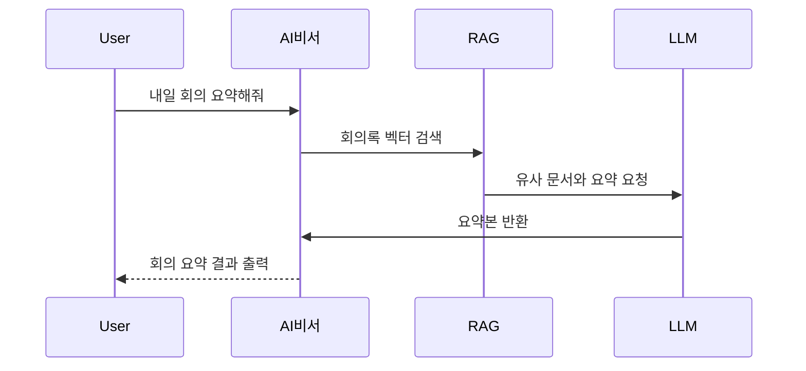

# SKN13-FINAL-1TEAM
SKN13 최종 프로젝트

---
아래는 주제 **“LLM 활용 내부고객 업무 효율성 향상을 위한 문서 검색 시스템”** 기반의 **AI 비서 서비스 기획안**입니다. 이 AI 비서는 단순한 검색을 넘어, 다양한 업무를 보조하고 자동화하는 \*\*"올인원 사내 업무 파트너"\*\*로 작동합니다.

---

## ✅ 서비스 개요

| 항목       | 내용                                                      |
| -------- | ------------------------------------------------------- |
| **서비스명** | AI 비서 (가칭: SmartWork Assistant)                         |
| **목표**   | LLM을 활용하여 임직원의 업무 효율을 극대화하고, 반복 업무 자동화 및 빠른 의사결정을 지원    |
| **대상**   | 전사 임직원 (기획, 개발, 영업, CS 등)                               |
| **핵심기능** | 문서 검색 및 요약, 회의록 자동화, 스케줄 관리, 문서 작성/결재, 이메일 자동화, 사내 챗봇 등 |

---

## 🧩 기능 상세

| 기능                    | 설명                                                                           |
| --------------------- | ---------------------------------------------------------------------------- |
| **1. 회의록/문서 요약**      | 업로드된 회의 녹취록 또는 문서(PDF, Word 등)를 LLM이 요약 → 핵심 의사결정, 담당자, 일정 등 자동 추출        |
| **2. 스케줄 관리/알람**      | 캘린더 연동하여 회의/업무 일정 확인 및 알림 설정 → "내일 회의 리마인드해줘" 등의 자연어 명령 지원                |
| **3. 메일 템플릿 작성 및 전송** | “인사팀에게 회식 안내 메일 작성해줘”와 같은 요청으로 → 목적에 맞는 이메일 템플릿 자동 생성 및 전송                |
| **4. To Do / 업무 브리핑** | 개인 업무를 리스트업하고 매일 아침/저녁 브리핑 → “오늘 처리할 업무 요약해줘”, “이번 주 마감 뭐야?” 등            |
| **5. 문서 초안 작성/편집/전송** | 제안서, 보고서, 기획안 등을 프롬프트 기반 자동 생성/편집 → 수신자 입력 시 자동 결재 라인 설정 및 전송             |
| **6. 업무/보조 QnA 챗봇**   | “출장비 정산은 어떻게 해?”, “연차 신청 규정은?”과 같은 질문에 → RAG 기반 사내 문서 검색 + 요약 후 답변        |

---

## 🔧 기능별 개발 난이도

| 기능명                   | 설명                      | 난이도          | 비고                               |
| --------------------- | ----------------------- | ------------ | -------------------------------- |
| **회의록 / 문서 요약**       | 텍스트 또는 음성 회의록을 받아 요약 제공 | **상급**       | Whisper(STT) + RAG + LLM 필요      |
| **스케줄 관리 / 알람**       | 일정 등록, 리마인드 메시지 전송      | **중급**       | Google Calendar / Outlook API 연동 |
| **To Do / 업무 브리핑**    | 할 일 등록/조회 및 요약 브리핑 제공   | **중급**       | 사용자 세션별 상태 저장 및 요약               |
| **문서 초안 작성 / 편집**     | 명령 기반 보고서/기획서 작성 보조     | **상급**       | 프롬프트 엔지니어링 + Doc Template 구성     |
| **업무/업무보조 QnA 챗봇**    | 사내 규정, 절차 등 자동 응답       | **상급**       | RAG + Vector DB 구축 필수            |

---

## 🔧 기술 스택

| 구분               | 기술                                               |
| ---------------- | ------------------------------------------------ |
| **백엔드**          | Django, FastAPI, PostgreSQL 또는 MySQL              |
| **LLM 기반**       | OpenAI GPT-4o 또는 Claude 3 + LangChain, LangGraph |
| **벡터 DB**        | Chroma 또는 Qdrant (사내문서 임베딩 저장)                   |
| **캘린더/메일 연동**    | Google Workspace API           |
| **결재/사내 시스템 연동** | 사내 ERP API 또는 그룹웨어 연동                            |
| **보안**           | 사내 SSO, JWT 인증 |

---

## 🧠 AI 처리 흐름 (예시)

---

## 📊 기대 효과

| 항목            | 효과                      |
| ------------- | ----------------------- |
| **업무 시간 절감**  | 반복 업무 자동화 (이메일, 문서초안 등) |
| **정보 접근성 향상** | 방대한 사내 문서 즉시 검색·요약 가능   |
| **협업 강화**     | 챗봇 기반 업무 공유, 메신저/메일 자동화 |
| **정확한 결재 흐름** | 자동 결재 및 알림으로 의사결정 속도 향상 |

---

## 🗂️ 개발 일정 예시 (8주)

| 주차     | 주요 내용                       |
| ------ | --------------------------- |
| 1주차    | 요구사항 정의, 데이터 수집 (회의록/사내 문서) |
| 2\~3주차 | 문서 벡터화 및 검색 시스템 구축 (RAG)    |
| 4\~5주차 | 기능별 모듈 개발 (요약, 스케줄, 이메일 등)  |
| 6주차    | 결재 및 알림 연동 구현               |
| 7주차    | 통합 테스트 및 피드백 반영             |
| 8주차    | 사내 배포 및 교육 자료 제작            |

---

