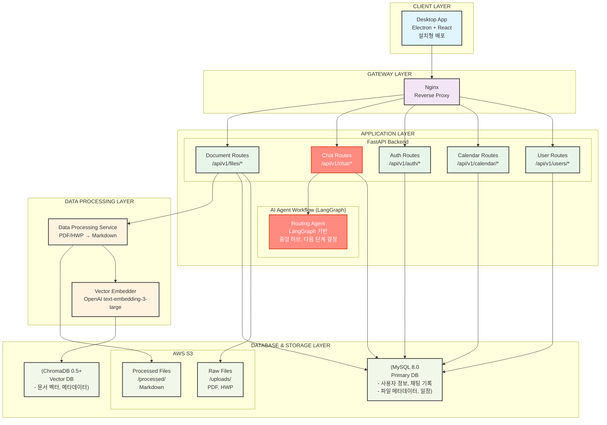
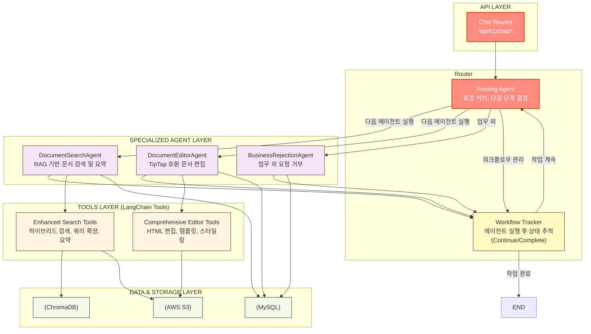
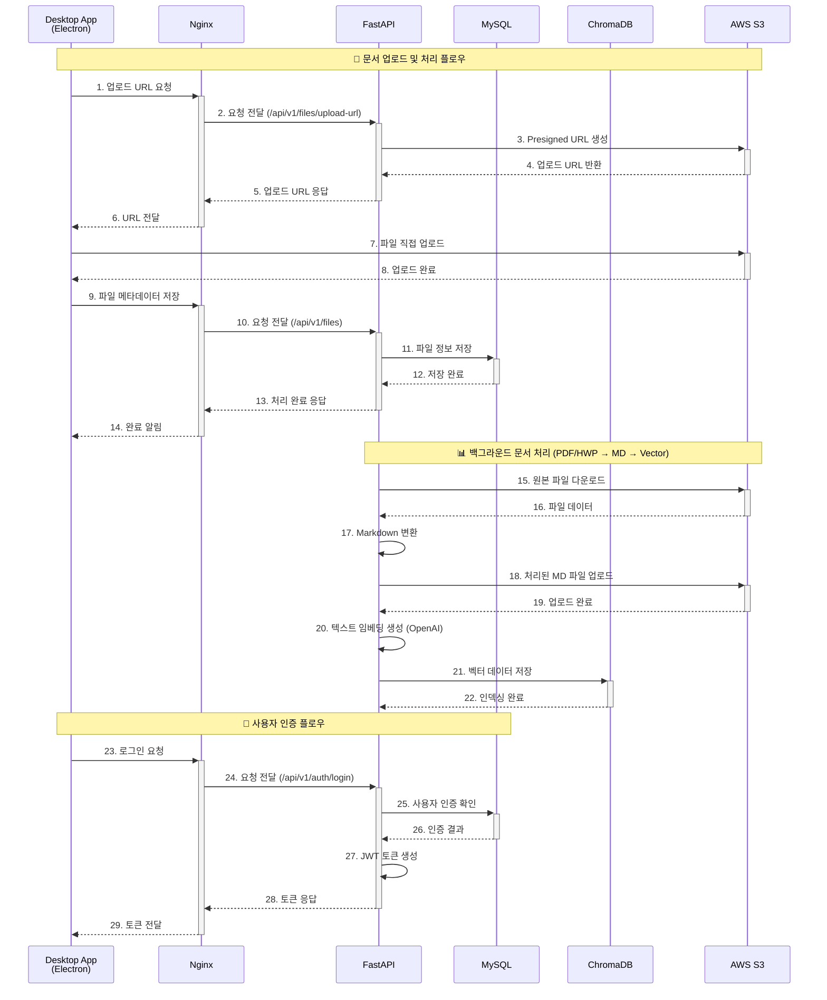
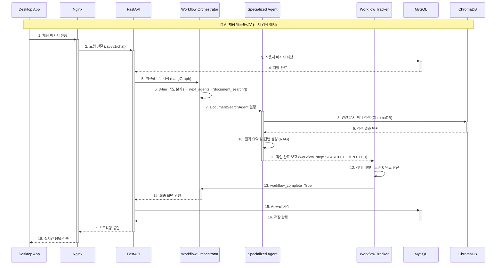
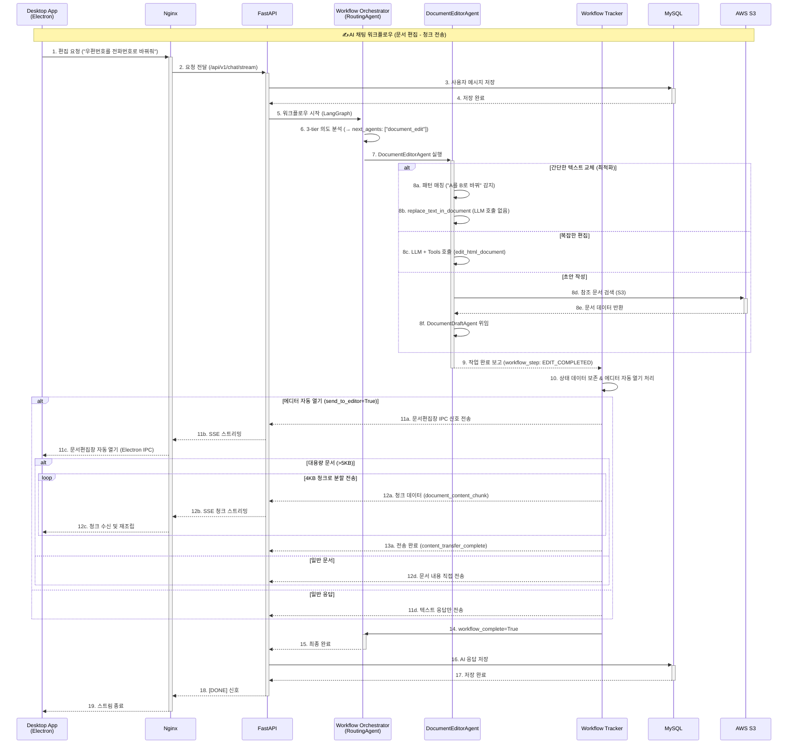
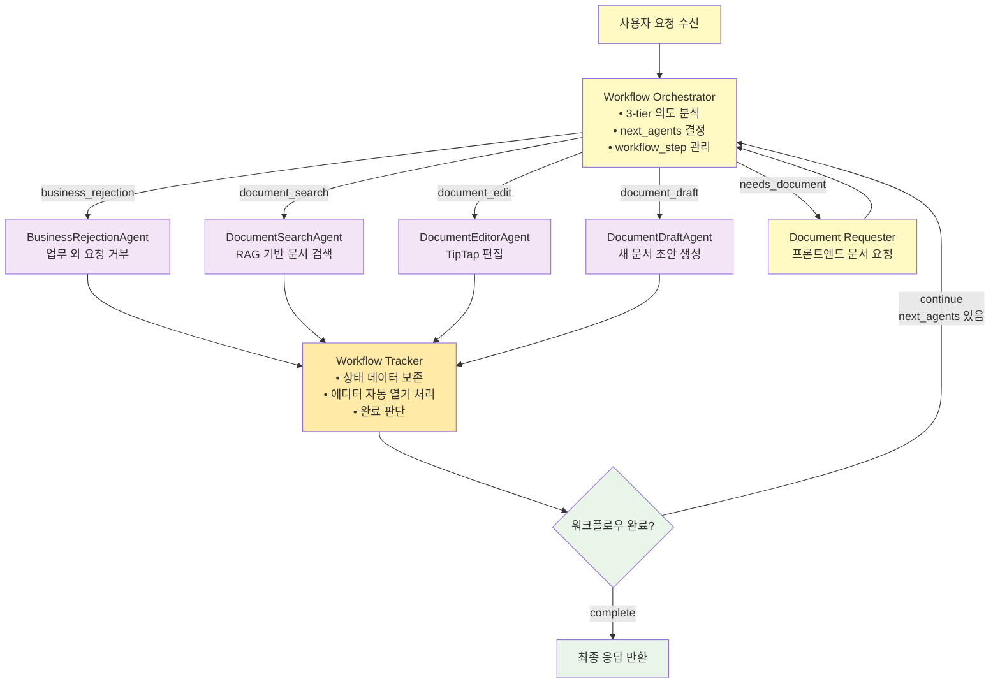
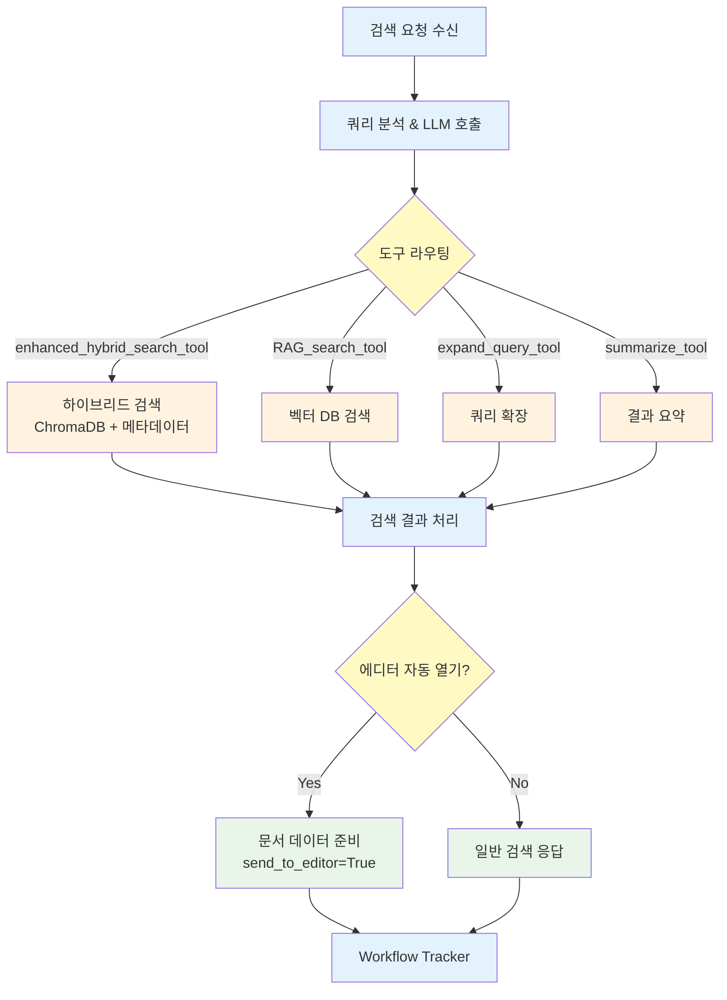
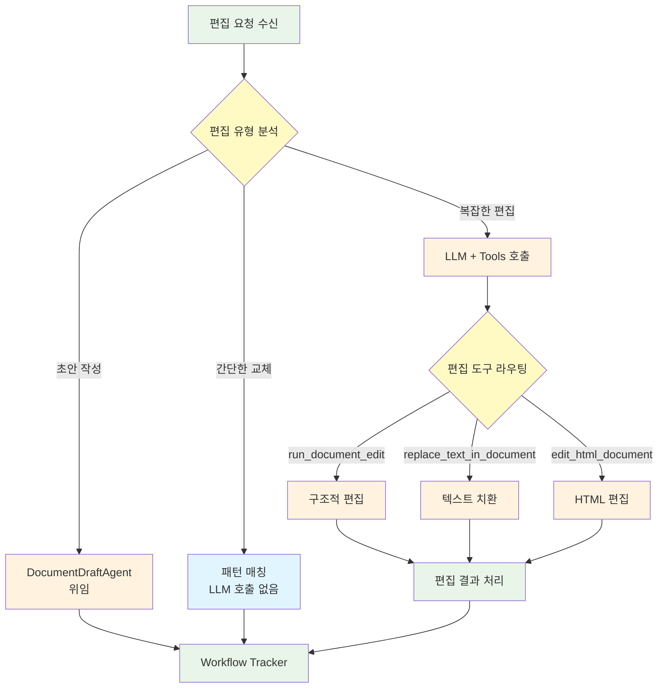

# 🔥 CLIKCA - RAG 기반 업무 보조 AI 비서

**SK Networks Family AI Camp 13기 최종 프로젝트 1팀**

> 클릭 한 번으로 업무 흐름을 연결하고 보조하는 **스마트 AI 업무 파트너**

## 📋 프로젝트 개요

**CLIKCA (Click + Assistant)**는 **Retrieval-Augmented Generation(RAG)** 기반 LLM 기술을 활용하여,
사내 문서 검색부터 보고서 작성, 일정 관리까지 다양한 업무를 **통합적으로 자동화**하는 AI 비서 시스템입니다.

### 🎯 핵심 목표
- **반복 업무 자동화**로 업무 효율성 극대화
- **자연어 처리** 기반 직관적 업무 보조
- **신입사원 온보딩 속도 향상** 및 조직 적응력 증대

---

## ✨ 주요 기능

### 🔍 **1. 문서 검색 및 요약**
- RAG 기반 사내 문서 검색 및 정확한 정보 추출
- PDF, Word 등 다양한 형식의 문서 자동 요약

### 📝 **2. 문서 편집 및 생성**
- Tiptap 기반 리치 텍스트 에디터로 실시간 문서 편집
- AI 기반 보고서, 기획안, 제안서 초안 자동 생성
- 다양한 문서 템플릿 제공

### 📅 **3. 일정 관리**
- 회의록에서 자동으로 일정 정보 추출 및 캘린더 등록
- 간트 차트 및 캘린더 뷰를 통한 시각적 일정 관리

### 🤖 **4. 챗봇 기반 업무 보조**
- 자연어 질의를 통한 사내 규정, 프로세스 안내
- 실시간 업무 상담 및 문제 해결 지원
- 개인화된 업무 브리핑 제공

---

## 🏗️ 전체 시스템 아키텍처

### 1. 시스템 구성도


```mermaid
graph TB
    %% CLIENT LAYER
    subgraph "CLIENT LAYER"
        DESKTOP["Desktop App<br/>Electron + React<br/>설치형 배포"]
    end

    %% GATEWAY LAYER
    subgraph "GATEWAY LAYER"
        NGINX["Nginx<br/>Reverse Proxy"]
    end

    %% APPLICATION LAYER
    subgraph "APPLICATION LAYER"
        subgraph "FastAPI Backend"
            DOC_API["Document Routes<br/>/api/v1/files/*"]
            CHAT_API["Chat Routes<br/>/api/v1/chat/*"]
            AUTH_API["Auth Routes<br/>/api/v1/auth/*"]
            CAL_API["Calendar Routes<br/>/api/v1/calendar/*"]
            USER_API["User Routes<br/>/api/v1/users/*"]
        end
        
        subgraph "AI Agent Workflow (LangGraph)"
            WORKFLOW["Routing Agent<br/>LangGraph 기반<br/>중앙 허브, 다음 단계 결정<br/>"]
        end
    end

    %% DATA PROCESSING LAYER
    subgraph "DATA PROCESSING LAYER"
        DATA_SERVICE["Data Processing Service<br/>PDF/HWP → Markdown"]
        VECTOR_EMB["Vector Embedder<br/>OpenAI text-embedding-3-large"]
    end

    %% DATABASE & STORAGE LAYER
    subgraph "DATABASE & STORAGE LAYER"
        subgraph "AWS S3"
            S3_RAW["Raw Files<br/>/uploads/<br/>PDF, HWP"]
            S3_PROCESSED["Processed Files<br/>/processed/<br/>Markdown"]
        end

        MYSQL["(MySQL 8.0<br/>Primary DB<br/>- 사용자 정보, 채팅 기록<br/>- 파일 메타데이터, 일정)"]
        
        CHROMADB["(ChromaDB 0.5+<br/>Vector DB<br/>- 문서 벡터, 메타데이터)"]
    end

    %% Flow
    DESKTOP --> NGINX
    NGINX --> DOC_API
    NGINX --> CHAT_API
    NGINX --> AUTH_API
    NGINX --> CAL_API
    NGINX --> USER_API

    CHAT_API --> WORKFLOW

    DOC_API --> DATA_SERVICE
    DATA_SERVICE --> S3_PROCESSED
    DATA_SERVICE --> VECTOR_EMB
    VECTOR_EMB --> CHROMADB

    AUTH_API & CHAT_API & DOC_API & CAL_API & USER_API --> MYSQL
    DOC_API --> S3_RAW

    %% Styling
    classDef client fill:#e1f5fe,stroke:#333,stroke-width:2px
    classDef gateway fill:#f3e5f5,stroke:#333,stroke-width:2px
    classDef app fill:#e8f5e9,stroke:#333,stroke-width:2px
    classDef workflow fill:#fff9c4,stroke:#333,stroke-width:2px
    classDef data fill:#fff3e0,stroke:#333,stroke-width:2px
    classDef db fill:#f1f8e9,stroke:#333,stroke-width:2px

    %% CHAT/WORKFLOW 전용 스타일 정의
    classDef chatSpecial fill:#ff8a80,stroke:#d84315,stroke-width:2px,color:#fff

    class DESKTOP client
    class NGINX gateway
    class DOC_API app
    class CHAT_API chatSpecial
    class AUTH_API app
    class CAL_API app
    class USER_API app
    class WORKFLOW chatSpecial
    class DATA_SERVICE data
    class VECTOR_EMB data
    class S3_RAW db
    class S3_PROCESSED db
    class MYSQL db
    class CHROMADB db
```

---

## 🤖 AI 에이전트 워크플로우 상세

### 1. Multi-Step Workflow 아키텍처 (LangGraph 기반)

새로운 아키텍처는 **`MultiStepWorkflowGraph`** 를 중심으로 구성됩니다. 이 그래프는 단순한 의도 분류를 넘어, 여러 AI 에이전트를 순차적 또는 조건부로 실행하여 복잡한 작업을 해결합니다.


```mermaid
graph TD
    subgraph "API LAYER"
        CHAT_ROUTER["Chat Routes<br/>/api/v1/chat/*"]
    end

    subgraph "Router"
        ORCHESTRATOR["Routing Agent<br/>중앙 허브, 다음 단계 결정<br/>"]
        WORKFLOW_TRACKER["Workflow Tracker<br/>에이전트 실행 후 상태 추적<br/>(Continue/Complete)"]
    end

    subgraph "SPECIALIZED AGENT LAYER"
        DOC_SEARCH["DocumentSearchAgent<br/>RAG 기반 문서 검색 및 요약"]
        DOC_EDIT["DocumentEditorAgent<br/>TipTap 호환 문서 편집"]
        BIZ_REJECT["BusinessRejectionAgent<br/>업무 외 요청 거부"]
    end

    subgraph "TOOLS LAYER (LangChain Tools)"
        SEARCH_TOOLS["Enhanced Search Tools<br/>하이브리드 검색, 쿼리 확장, 요약"]
        EDITOR_TOOLS["Comprehensive Editor Tools<br/>HTML 편집, 템플릿, 스타일링"]
    end

    subgraph "DATA & STORAGE LAYER"
        CHROMADB["(ChromaDB)"]
        MYSQL["(MySQL)"]
        S3["(AWS S3)"]
    end

    %% Connections
    CHAT_ROUTER --> ORCHESTRATOR

    ORCHESTRATOR -- "다음 에이전트 실행" --> DOC_SEARCH
    ORCHESTRATOR -- "다음 에이전트 실행" --> DOC_EDIT
    ORCHESTRATOR -- "업무 외" --> BIZ_REJECT
    ORCHESTRATOR -- "워크플로우 관리" --> WORKFLOW_TRACKER

    DOC_SEARCH --> WORKFLOW_TRACKER
    DOC_EDIT --> WORKFLOW_TRACKER
    BIZ_REJECT --> WORKFLOW_TRACKER

    WORKFLOW_TRACKER -- "작업 계속" --> ORCHESTRATOR
    WORKFLOW_TRACKER -- "작업 완료" --> END

    DOC_SEARCH --> SEARCH_TOOLS
    DOC_EDIT --> EDITOR_TOOLS

    SEARCH_TOOLS --> CHROMADB
    SEARCH_TOOLS --> S3
    EDITOR_TOOLS --> S3

    DOC_SEARCH & DOC_EDIT & BIZ_REJECT --> MYSQL

    %% Styling
    classDef api fill:#e8f5e9,stroke:#333
    classDef orchestrator fill:#fff9c4,stroke:#333
    classDef agent fill:#f3e5f5,stroke:#333
    classDef tool fill:#fff3e0,stroke:#333
    classDef data fill:#f1f8e9,stroke:#333

    %% 코랄핑크 강조 스타일
    classDef chatSpecial fill:#ff8a80,stroke:#d84315,stroke-width:2px,color:#fff

    class CHAT_ROUTER chatSpecial
    class ORCHESTRATOR chatSpecial
    class WORKFLOW_TRACKER orchestrator
    class DOC_SEARCH agent
    class DOC_EDIT agent
    class BIZ_REJECT agent
    class SEARCH_TOOLS tool
    class EDITOR_TOOLS tool
    class CHROMADB data
    class MYSQL data
    class S3 data
```

### 2. Sequence Diagram

#### 2.1. 문서 처리 및 인증


```mermaid
sequenceDiagram
    participant C as Desktop App<br/>(Electron)
    participant N as Nginx
    participant API as FastAPI
    participant DB as MySQL
    participant V as ChromaDB
    participant S3 as AWS S3

    Note over C,S3: 📄 문서 업로드 및 처리 플로우
    
    C->>+N: 1. 업로드 URL 요청
    N->>+API: 2. 요청 전달 (/api/v1/files/upload-url)
    API->>+S3: 3. Presigned URL 생성
    S3-->>-API: 4. 업로드 URL 반환
    API-->>-N: 5. 업로드 URL 응답
    N-->>-C: 6. URL 전달
    
    C->>+S3: 7. 파일 직접 업로드
    S3-->>-C: 8. 업로드 완료
    
    C->>+N: 9. 파일 메타데이터 저장
    N->>+API: 10. 요청 전달 (/api/v1/files)
    API->>+DB: 11. 파일 정보 저장
    DB-->>-API: 12. 저장 완료
    API-->>-N: 13. 처리 완료 응답
    N-->>-C: 14. 완료 알림
    
    Note over API,S3: 📊 백그라운드 문서 처리 (PDF/HWP → MD → Vector)
    API->>+S3: 15. 원본 파일 다운로드
    S3-->>-API: 16. 파일 데이터
    API->>API: 17. Markdown 변환
    API->>+S3: 18. 처리된 MD 파일 업로드
    S3-->>-API: 19. 업로드 완료
    API->>API: 20. 텍스트 임베딩 생성 (OpenAI)
    API->>+V: 21. 벡터 데이터 저장
    V-->>-API: 22. 인덱싱 완료

    Note over C,DB: 🔐 사용자 인증 플로우
    
    C->>+N: 23. 로그인 요청
    N->>+API: 24. 요청 전달 (/api/v1/auth/login)
    API->>+DB: 25. 사용자 인증 확인
    DB-->>-API: 26. 인증 결과
    API->>API: 27. JWT 토큰 생성
    API-->>-N: 28. 토큰 응답
    N-->>-C: 29. 토큰 전달
```

#### 2.2. AI 채팅 (문서 검색 예시)


```mermaid
sequenceDiagram
    participant C as Desktop App
    participant N as Nginx
    participant API as FastAPI
    participant Orch as Workflow Orchestrator
    participant Agent as Specialized Agent
    participant Tracker as Workflow Tracker
    participant DB as MySQL
    participant V as ChromaDB

    Note over C,V: 💬 AI 채팅 워크플로우 (문서 검색 예시)

    C->>+N: 1. 채팅 메시지 전송
    N->>+API: 2. 요청 전달 (/api/v1/chat)
    
    API->>+DB: 3. 사용자 메시지 저장
    DB-->>-API: 4. 저장 완료
    
    API->>+Orch: 5. 워크플로우 시작 (LangGraph)
    Orch->>Orch: 6. 3-tier 의도 분석 (→ next_agents: ["document_search"])

    Orch->>+Agent: 7. DocumentSearchAgent 실행
    Agent->>+V: 8. 관련 문서 벡터 검색 (ChromaDB)
    V-->>-Agent: 9. 검색 결과 반환
    Agent->>Agent: 10. 결과 요약 및 답변 생성 (RAG)
    Agent-->>-Tracker: 11. 작업 완료 보고 (workflow_step: SEARCH_COMPLETED)

    Tracker->>Tracker: 12. 상태 데이터 보존 & 완료 판단
    Tracker->>+Orch: 13. workflow_complete=True
    Orch-->>-API: 14. 최종 답변 반환

    API->>+DB: 15. AI 응답 저장
    DB-->>-API: 16. 저장 완료

    API-->>-N: 17. 스트리밍 응답
    N-->>-C: 18. 실시간 응답 전송
```

#### 2.3. AI 채팅 (문서 편집 예시)


```mermaid
sequenceDiagram
    participant C as Desktop App<br/>(Electron)
    participant N as Nginx
    participant API as FastAPI
    participant Orch as Workflow Orchestrator<br/>(RoutingAgent)
    participant Agent as DocumentEditorAgent
    participant Tracker as Workflow Tracker
    participant DB as MySQL
    participant S3 as AWS S3

    Note over C,S3: ✍️ AI 채팅 워크플로우 (문서 편집 - 청크 전송)

    C->>+N: 1. 편집 요청 ("우편번호를 전화번호로 바꿔줘")
    N->>+API: 2. 요청 전달 (/api/v1/chat/stream)

    API->>+DB: 3. 사용자 메시지 저장
    DB-->>-API: 4. 저장 완료

    API->>+Orch: 5. 워크플로우 시작 (LangGraph)
    Orch->>Orch: 6. 3-tier 의도 분석 (→ next_agents: ["document_edit"])

    Orch->>+Agent: 7. DocumentEditorAgent 실행

    alt 간단한 텍스트 교체 (최적화)
        Agent->>Agent: 8a. 패턴 매칭 ("A를 B로 바꿔" 감지)
        Agent->>Agent: 8b. replace_text_in_document (LLM 호출 없음)
    else 복잡한 편집
        Agent->>Agent: 8c. LLM + Tools 호출 (edit_html_document)
    else 초안 작성
        Agent->>+S3: 8d. 참조 문서 검색 (S3)
        S3-->>-Agent: 8e. 문서 데이터 반환
        Agent->>Agent: 8f. DocumentDraftAgent 위임
    end

    Agent-->>-Tracker: 9. 작업 완료 보고 (workflow_step: EDIT_COMPLETED)

    Tracker->>Tracker: 10. 상태 데이터 보존 & 에디터 자동 열기 처리

    alt 에디터 자동 열기 (send_to_editor=True)
        Tracker-->>API: 11a. 문서편집창 IPC 신호 전송
        API-->>N: 11b. SSE 스트리밍
        N-->>C: 11c. 문서편집창 자동 열기 (Electron IPC)

        alt 대용량 문서 (>5KB)
            loop 4KB 청크로 분할 전송
                Tracker-->>API: 12a. 청크 데이터 (document_content_chunk)
                API-->>N: 12b. SSE 청크 스트리밍
                N-->>C: 12c. 청크 수신 및 재조립
            end
            Tracker-->>API: 13a. 전송 완료 (content_transfer_complete)
        else 일반 문서
            Tracker-->>API: 12d. 문서 내용 직접 전송
        end
    else 일반 응답
        Tracker-->>API: 11d. 텍스트 응답만 전송
    end

    Tracker->>+Orch: 14. workflow_complete=True
    Orch-->>-API: 15. 최종 완료

    API->>+DB: 16. AI 응답 저장
    DB-->>-API: 17. 저장 완료

    API-->>-N: 18. [DONE] 신호
    N-->>-C: 19. 스트림 종료
```

### 3. 새로운 워크플로우 구조

#### 3-1. 워크플로우 오케스트레이터 (실제 LangGraph 노드 구조)


```mermaid
graph TD
    A[사용자 요청 수신] --> B[Workflow Orchestrator<br/>• 3-tier 의도 분석<br/>• next_agents 결정<br/>• workflow_step 관리]

    B -->|business_rejection| E[BusinessRejectionAgent<br/>업무 외 요청 거부]
    B -->|document_search| F[DocumentSearchAgent<br/>RAG 기반 문서 검색]
    B -->|document_edit| G[DocumentEditorAgent<br/>TipTap 편집]
    B -->|document_draft| H[DocumentDraftAgent<br/>새 문서 초안 생성]
    B -->|needs_document| R[Document Requester<br/>프론트엔드 문서 요청]

    E --> I[Workflow Tracker<br/>• 상태 데이터 보존<br/>• 에디터 자동 열기 처리<br/>• 완료 판단]
    F --> I
    G --> I
    H --> I
    R --> B

    I --> J{워크플로우 완료?}
    J -->|continue<br/>next_agents 있음| B
    J -->|complete| K[최종 응답 반환]

    classDef orchestrationProcess fill:#fff9c4
    classDef agentProcess fill:#f3e5f5
    classDef trackerProcess fill:#ffeaa7
    classDef endProcess fill:#e8f5e8

    class A,B,R orchestrationProcess
    class E,F,G,H agentProcess
    class I trackerProcess
    class J,K endProcess
```

#### 3-2. DocumentSearchAgent (핵심 라우팅 구조)


```mermaid
graph TD
    A["검색 요청 수신"] --> B["쿼리 분석 & LLM 호출"]
    B --> C{도구 라우팅}

    C -->|enhanced_hybrid_search_tool| D["하이브리드 검색<br/>ChromaDB + 메타데이터"]
    C -->|RAG_search_tool| E["벡터 DB 검색"]
    C -->|expand_query_tool| F["쿼리 확장"]
    C -->|summarize_tool| G["결과 요약"]

    D --> H["검색 결과 처리"]
    E --> H
    F --> H
    G --> H

    H --> I{에디터 자동 열기?}
    I -->|Yes| J["문서 데이터 준비<br/>send_to_editor=True"]
    I -->|No| K["일반 검색 응답"]

    J --> L["Workflow Tracker"]
    K --> L

    classDef process fill:#e3f2fd
    classDef routing fill:#fff9c4
    classDef tools fill:#fff3e0
    classDef completion fill:#e8f5e8

    class A,B,H,L process
    class C,I routing
    class D,E,F,G tools
    class J,K completion
```

#### 3-3. DocumentEditorAgent (핵심 라우팅 구조)


```mermaid
graph TD
    A["편집 요청 수신"] --> B{편집 유형 분석}

    B -->|초안 작성| C["DocumentDraftAgent<br/>위임"]
    B -->|간단한 교체| D["패턴 매칭<br/>LLM 호출 없음"]
    B -->|복잡한 편집| E["LLM + Tools 호출"]

    E --> F{편집 도구 라우팅}
    F -->|run_document_edit| G["구조적 편집"]
    F -->|replace_text_in_document| H["텍스트 치환"]
    F -->|edit_html_document| I["HTML 편집"]

    G --> J["편집 결과 처리"]
    H --> J
    I --> J

    C --> K["Workflow Tracker"]
    D --> K
    J --> K

    classDef process fill:#e8f5e8
    classDef routing fill:#fff9c4
    classDef optimization fill:#e1f5fe
    classDef tools fill:#fff3e0

    class A,J,K process
    class B,F routing
    class D optimization
    class C,E,G,H,I tools
```
---

### 🔧 기술 스택

#### **Frontend**
- **React 19** + **Vite** - 모던 프론트엔드 개발 환경
- **Tiptap** - 리치 텍스트 에디터로 문서 편집 기능
- **Tailwind CSS** - 반응형 UI 디자인
- **React Big Calendar** - 일정 관리 인터페이스
- **Axios** - API 통신 라이브러리

#### **Backend**
- **FastAPI** - 고성능 비동기 웹 프레임워크
- **SQLModel** - 데이터베이스 ORM
- **SQLite** - 로컬 데이터베이스

#### **AI & RAG**
- **OpenAI GPT-4o** - 메인 LLM 모델
- **LangChain** & **LangGraph** - AI 워크플로우 관리
- **ChromaDB** - 벡터 데이터베이스로 문서 임베딩 저장

#### **Infrastructure**
- **Docker** - 컨테이너화 배포
- **AWS** - 클라우드 인프라

### 📁 프로젝트 구조

```
FinalProject/
├── backend/                         # FastAPI 백엔드
│   ├── __init__.py
│   ├── ChatBot/                     # 챗봇 모듈
│   │   ├── __init__.py
│   │   ├── agents/                  # 에이전트
│   │   │   ├── BusinessRejectionAgent.py
│   │   │   ├── DocumentDraftAgent.py
│   │   │   ├── DocumentEditorAgent.py
│   │   │   ├── DocumentSearchAgent.py
│   │   │   ├── DocumentSelectionAgent.py
│   │   │   ├── GeneralChatAgent.py
│   │   │   └── RoutingAgent.py
│   │   ├── config/
│   │   │   ├── __init__.py
│   │   │   └── settings.py
│   │   ├── core/
│   │   │   ├── AgentState.py
│   │   │   └── workflow_graph.py
│   │   ├── prompts/
│   │   │   ├── DocumentEditorSystemPrompt.py
│   │   │   ├── DocumentSearchSystemPrompt.py
│   │   │   └── system_prompt.py
│   │   ├── tools/
│   │   │   ├── agent_logic.py
│   │   │   ├── document_draft_generator_tool.py
│   │   │   ├── editor_tool.py
│   │   │   ├── editor_tool_new.py
│   │   │   ├── enhanced_hybrid_search_tool.py
│   │   │   ├── html_to_docx.py
│   │   │   ├── hybrid_document_search_tool.py
│   │   │   ├── local_document_search_tool.py
│   │   │   ├── retriever_tool.py
│   │   │   └── editor_strategies/
│   │   │       ├── __init__.py
│   │   │       ├── advanced_editing_strategy.py
│   │   │       ├── base_strategy.py
│   │   │       ├── basic_text_strategy.py
│   │   │       ├── html_editing_strategy.py
│   │   │       └── structure_template_strategy.py
│   │   └── utils/
│   │       └── error_handler.py
│   ├── database/                    # DB 레이어
│   │   ├── __init__.py
│   │   ├── base.py
│   │   ├── connection.py
│   │   └── models/
│   │       ├── __init__.py
│   │       ├── calendar.py
│   │       ├── chat.py
│   │       ├── document.py
│   │       ├── system.py
│   │       └── user.py
│   ├── routers/                     # API 라우터
│   │   ├── auth_routes.py
│   │   ├── calendar_routes.py
│   │   ├── chat_routes.py
│   │   ├── document_routes.py
│   │   └── users_routes.py
│   ├── services/
│   │   └── greeting_service.py
│   ├── etc/
│   │   ├── RAG_Agent.py
│   │   └── llm_tools/
│   │       ├── __init__.py
│   │       ├── chat_history_manager.py
│   │       ├── edit_hwpx.py
│   │       ├── edit_hwpx1.py
│   │       ├── get_weather.py
│   │       ├── google_places.py
│   │       ├── naver_search.py
│   │       ├── read_hwpx.py
│   │       ├── retriever.py
│   │       ├── s3_url_generator.py
│   │       └── sEOUl.py
│   ├── create_example.py
│   ├── create_missing_tables.py
│   ├── generate_presigned_url.py
│   ├── presigned.py
│   ├── main.py
│   ├── Dockerfile
│   ├── ENDPOINTS_README.md
│   ├── requirements.txt
│   └── s3-handler.js
├── frontend-ui/                     # React 프론트엔드
│   ├── Dockerfile
│   ├── eslint.config.js
│   ├── feature.html
│   ├── index.html
│   ├── nginx.conf
│   ├── package.json
│   ├── package-lock.json
│   ├── postcss.config.js
│   ├── public/
│   │   └── vite.svg
│   ├── src/
│   │   ├── App.jsx
│   │   ├── assets/
│   │   ├── components/
│   │   ├── index.css
│   │   ├── index.js
│   │   └── main.jsx
│   ├── tailwind.config.js
│   └── vite.config.js
├── chroma_db/
│   └── chroma.sqlite3
├── htmlcov/                         # 커버리지 리포트
├── images/
├── locust/
│   ├── __pycache__/
│   └── reports/
├── editable_markdown/
├── backend_debug.log
├── collected.txt
├── conftest.py
├── ELECTRON_LOCAL_EDIT_GUIDE.md
├── pytest.ini
├── requirements-test.txt
├── test 결과.md
├── test_editor_refactoring.py
├── test_error_handling.py
├── test_new_architecture.py
├── test_runner.py
├── tests/
│   ├── README.md
│   ├── reports/
│   ├── test_agents.py
│   ├── test_api.py
│   ├── test_database.py
│   └── test_integration_advanced.py
└── uploaded_files/
```

---

## 🚀 시작하기

### 📋 필수 요구사항
- **Node.js** 18.0 이상
- **Python** 3.9 이상
- **OpenAI API Key**

### 🔧 설치 및 실행

#### 1. 저장소 클론
```bash
git clone https://github.com/your-repo/clikca.git
cd clikca/FinalProject
```

#### 2. 백엔드 설정
```bash
cd backend
pip install -r requirements.txt

# 환경변수 설정
export OPENAI_API_KEY="your_openai_api_key"

# 서버 실행
python -m uvicorn main:app --reload --host 0.0.0.0 --port 8000
```

#### 3. 프론트엔드 설정
```bash
cd frontend-ui
npm install

# 개발 서버 실행
npm run dev
```

#### 4. 접속
- **Frontend**: http://localhost:5173
- **Backend API**: http://localhost:8000
- **API 문서**: http://localhost:8000/docs

---

## 🔌 주요 API 엔드포인트

### 📄 **문서 관리**
- `POST /documents/upload` - 문서 업로드
- `GET /documents/{doc_id}` - 문서 조회
- `PUT /documents/{doc_id}` - 문서 수정
- `DELETE /documents/{doc_id}` - 문서 삭제

### 💬 **챗봇**
- `POST /chat/message` - 채팅 메시지 전송
- `GET /chat/history/{session_id}` - 채팅 기록 조회

### 📅 **일정 관리**
- `POST /calendar/events` - 일정 등록
- `GET /calendar/events` - 일정 조회
- `PUT /calendar/events/{event_id}` - 일정 수정

### 👤 **사용자 인증**
- `POST /auth/login` - 로그인
- `POST /auth/register` - 회원가입
- `GET /auth/me` - 사용자 정보 조회

---

## 🎨 주요 화면

### 📝 **문서 에디터**
- Tiptap 기반 리치 텍스트 에디터
- AI 기반 문서 초안 생성
- 실시간 문서 저장 및 공유

### 💬 **챗봇 인터페이스**
- 실시간 AI 상담 창
- RAG 기반 정확한 정보 제공
- 대화 기록 저장 및 검색

### 📅 **일정 관리 대시보드**
- 캘린더 및 간트 차트 뷰
- 일정 자동 추출 및 등록
- Google 캘린더 동기화

---

## 👥 팀 소개

| 이름 | 역할 | 담당 영역 | GitHub |
|------|------|-----------|--------|
| **남궁건우** | 🎯 PM | 프로젝트 총괄, 시스템 설계 | [@namgung-geon-woo](https://github.com/namgung-geon-woo) |
| **이명인** | 📊 Data Engineer | 데이터 수집/전처리, 벡터 DB | [@lee-myeong-in](https://github.com/lee-myeong-in) |
| **우지훈** | ⚡ Backend Developer | API 서버, AI Agent 시스템 | [@woo-ji-hoon](https://github.com/woo-ji-hoon) |
| **홍채우** | 🎨 Frontend Developer | React UI/UX, 사용자 경험 | [@hong-chae-woo](https://github.com/hong-chae-woo) |
| **김승호** | 🎨 Frontend Developer | TipTap 에디터, 컴포넌트 | [@kim-seung-ho](https://github.com/kim-seung-ho) |

---

## 📊 추진 배경 및 기대 효과

### 📈 **추진 배경**
현대 조직에서는 잦은 **인사 이동**, **신입사원 채용**, **부서 간 협업**이 이루어지며, 새로운 환경에 빠르게 적응하는 것이 주요 과제로 떠오르고 있습니다.

기존의 업무 매뉴얼이나 구두 안내, 수작업 기반의 문서 검색만으로는 효과적인 업무 습득과 처리가 어려워, RAG 기반 LLM 기술을 도입한 AI 비서 시스템의 필요성이 대두되었습니다.

### 🎯 **기대 효과**
- ⏱ **업무 시간 절감**: 반복적 문서 작성, 일정 등록, 이메일 발송 자동화
- 🔍 **정보 접근성 향상**: 사내 문서 검색과 요약으로 정확한 정보 접근
- 🤝 **협업 촉진**: 공유 기능으로 부서 간 업무 협업 촉진
- 🧑‍💼 **신입사원 온보딩 속도 향상**: 문서 기반 Q&A로 빠른 적응 지원

---

## 🤝 기여하기

1. **Fork** 프로젝트
2. **Feature branch** 생성 (`git checkout -b feature/AmazingFeature`)
3. **Commit** 변경사항 (`git commit -m 'Add some AmazingFeature'`)
4. **Push** to branch (`git push origin feature/AmazingFeature`)
5. **Pull Request** 생성


---

## 🙏 감사의 말

**SK Networks Family AI Camp 13기**의 지원과 **한국방송광고진흥공사(KOBACO)**의 데이터 제공에 감사드립니다.

---

<div align="center">

**CLIKCA** - *한 번의 클릭으로 완성하는 스마트 업무 환경*