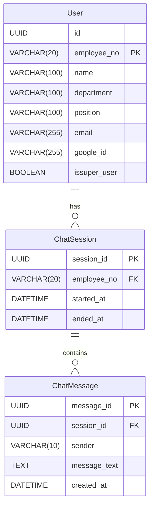

 **데이터 수집 및  저장 데이터베이스 설계문서**

| 산출물 단계 |  데이터 수집 및  저장 |
| :---: | :---- |
| **평가 산출물** | 데이터베이스 설계문서 |
| **제출 일자** |  |
| **깃허브 경로** | https://github.com/SKNETWORKS-FAMILY-AICAMP/SKN13-FINAL-1TEAM |
| **작성 팀원** | 남궁건우 |

1. **채택한 모델링 방법론: Crow’s Foot**

2. **논리 데이터 모델**

2.1 엔터티 목록

| 엔터티명           | 설명           | 식별자 (PK)                  | 속성명            | 데이터 타입       | Not Null | 설명                           |
| -------------- | ------------ | ------------------------- | -------------- | ------------ | -------- | ---------------------------- |
| User           | 사용자 정보       | employee\_no              | id             | UUID         | ✅        | 내부 시스템 식별자 (자동 생성 UUID)      |
|                |              |                           | employee\_no   | VARCHAR(20)  | ✅        | 사원번호 (PK)                    |
|                |              |                           | name           | VARCHAR(100) | ✅        | 사용자 이름                       |
|                |              |                           | department     | VARCHAR(100) | ✅        | 소속 부서                        |
|                |              |                           | position       | VARCHAR(100) | ✅        | 직책                           |
|                |              |                           | email          | VARCHAR(255) | ✅        | 이메일                          |
|                |              |                           | google\_id     | VARCHAR(255) |          | Google ID (OAuth 등)          |
|                |              |                           | issuper_user   | BOOLEAN      | ✅       | 관리자 여부                 |  
| ChatSession    | 사용자 채팅 세션    | session\_id               | session\_id    | UUID         | ✅        | 채팅 세션 고유 ID                  |
|                |              |                           | employee\_no   | VARCHAR(20)  | ✅        | 사용자 ID (FK to User)          |
|                |              |                           | started\_at    | DATETIME     | ✅        | 세션 시작 시간                     |
|                |              |                           | ended\_at      | DATETIME     |          | 세션 종료 시간                     |
| ChatMessage    | 세션 내 채팅 메시지  | message\_id               | message\_id    | UUID         | ✅        | 메시지 고유 ID                    |
|                |              |                           | session\_id    | UUID         | ✅        | 채팅 세션 ID (FK to ChatSession) |
|                |              |                           | sender         | VARCHAR(10)  | ✅        | 발신자 ('user' 또는 'assistant')  |
|                |              |                           | message\_text  | TEXT         | ✅        | 메시지 본문                       |
|                |              |                           | created\_at    | DATETIME     | ✅        | 생성 시각                        |

2.2 엔터티 간 관계

| 관계명                       | 주 엔터티       | 종 엔터티          | 관계 종류 | 설명                           |
| ------------------------- | ----------- | -------------- | ----- | ---------------------------- |
| User - ChatSession        | User        | ChatSession    | 1:N  | 한 사용자는 여러 개의 채팅 세션을 가질 수 있음  |
| ChatSession - ChatMessage | ChatSession | ChatMessage    | 1:N  | 하나의 세션은 여러 개의 채팅 메시지를 포함함    |
| User - RecentDocument     | User        | RecentDocument | 1:N  | 한 사용자는 여러 개의 최근 문서를 열람할 수 있음 |

2.3 ERD (이미지로 삽입)

**3\. 물리 데이터 모델**

3.1 테이블 정의서

- User

| 테이블명 | 컬럼명          | 데이터 타입       | PK | FK | Not Null | 제약조건 설명                    |
| ---- | ------------ | ------------ | -- | -- | -------- | -------------------------- |
| User | id           | UUID         |    |    | ✅        | 시스템 내부 ID (UUID 자동 생성)     |
|      | employee_no | VARCHAR(20)  | ✅  |    | ✅        | 사원번호, 사용자 식별자              |
|      | name         | VARCHAR(100) |    |    | ✅        | 이름                         |
|      | department   | VARCHAR(100) |    |    | ✅        | 소속 부서                      |
|      | position     | VARCHAR(100) |    |    | ✅        | 직책                         |
|      | email        | VARCHAR(255) |    |    | ✅        | 이메일                        |
|      | google_id   | VARCHAR(255) |    |    |          | Google OAuth 연동 ID (선택 사항) |
|      | issuper_user| BOOLEAN      |    |    | ✅      | 관리자 여부                      |    

- ChatSession

| 테이블명        | 컬럼명          | 데이터 타입      | PK | FK | Not Null | 제약조건 설명                 |
| ----------- | ------------ | ----------- | -- | -- | -------- | ----------------------- |
| ChatSession | session_id  | UUID        | ✅  |    | ✅        | 채팅 세션 ID                |
|             | employee_no | VARCHAR(20) |    | ✅  | ✅        | FK to User.employee\_no |
|             | started_at  | DATETIME    |    |    | ✅        | 세션 시작 시간                |
|             | ended_at    | DATETIME    |    |    |          | 세션 종료 시간 (nullable)     |

- ChatMessage

| 테이블명        | 컬럼명           | 데이터 타입      | PK | FK | Not Null | 제약조건 설명                       |
| ----------- | ------------- | ----------- | -- | -- | -------- | ----------------------------- |
| ChatMessage | message_id   | UUID        | ✅  |    | ✅        | 메시지 고유 ID                     |
|             | session_id   | UUID        |    | ✅  | ✅        | FK to ChatSession.session\_id |
|             | sender        | VARCHAR(10) |    |    | ✅        | 발신자 (‘user’ 또는 ‘assistant’)   |
|             | message_text | TEXT        |    |    | ✅        | 메시지 내용                        |
|             | created_at   | DATETIME    |    |    | ✅        | 생성 시각                         |

3.2 제약 조건 명세

| 구분              | 상세 내용                   |
| --------------- | ----------------------- |
| **Primary Key** | - `User`: `employee_no` |
||- `ChatSession`: `session_id`|
||- `ChatMessage`: `message_id`|
| **Foreign Key**  | - `ChatSession.employee_no` → `User.employee_no`|
||  → `ON DELETE CASCADE`, `ON UPDATE CASCADE`|
|| - `ChatMessage.session_id` → `ChatSession.session_id`|
||  → `ON DELETE CASCADE`, `ON UPDATE CASCADE`|
| **Unique**       | - `User.email` → UNIQUE 제약 조건 설정 (이메일 중복 방지) - `User.employee_no` → PK이므로 자동 UNIQUE |
| **Index**        | - FK 필드(`employee_no`, `session_id`)에 자동 인덱스 생성

4. **데이터 정합성 및 무결성 관리 방안**

| 항목                | 적용 내용                                                                                                                                                       |
| ----------------- | ----------------------------------------------------------------------------------------------------------------------------------------------------------- |
| **중복 방지 전략**      | - `User.email`은 UNIQUE 제약 조건으로 설정하여 이메일 중복 방지                                                           |
| **정규화 수준**        | - **1NF**: 모든 컬럼은 원자값만을 가짐 - **2NF**: 복합키를 가진 테이블(RecentDocument)에서 부분 함수 종속 없음 - **3NF**: 모든 속성은 기본키에만 종속됨                                           |
| **어플리케이션/백엔드 검증** | - 회원가입 시 이메일, 사번 중복 체크 - 채팅/문서 접근 시 FK 존재 여부 검증 - 입력 필드에 대한 유효성 체크(예: 이메일 형식, 길이 제한 등)                                                                |
| **예외 데이터 처리 전략**  | - FK 대상 데이터 삭제 시 CASCADE로 연쇄 삭제 처리 - nullable 필드(`ended_at`, `google_id`)는 NULL 허용 후 처리 시 조건 분기 - 불완전하거나 유효하지 않은 입력은 API 레벨에서 reject 처리 및 로깅 |

