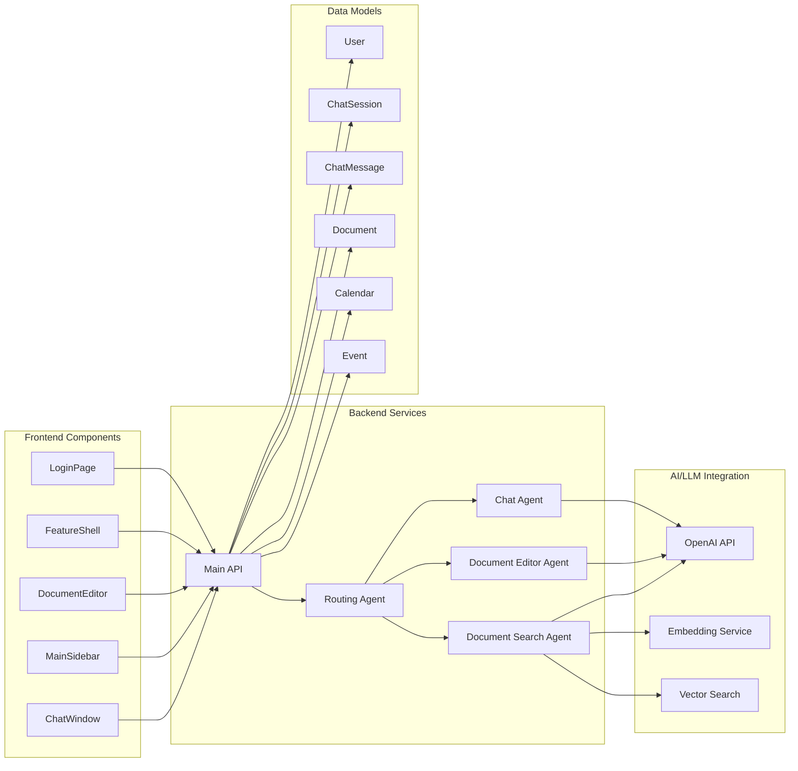

```mermaid
graph LR
    subgraph "Frontend Components"
        FC1[ChatWindow]
        FC2[MainSidebar]
        FC3[DocumentEditor]
        FC4[FeatureShell]
        FC5[LoginPage]
    end

    subgraph "Backend Services"
        BS1[Main API]
        BS3[Document Search Agent]
        BS4[Document Editor Agent]
        BS5[Routing Agent]
        BS6[Chat Agent]
    end

    subgraph "AI/LLM Integration"
        AI1[OpenAI API]
        AI3[Embedding Service]
        AI4[Vector Search]
    end

    subgraph "Data Models"
        DM1[User]
        DM2[ChatSession]
        DM3[ChatMessage]
        DM4[Document]
        DM5[Calendar]
        DM6[Event]
    end

    FC1 --> BS1
    FC2 --> BS1
    FC3 --> BS1
    FC4 --> BS1
    FC5 --> BS1
    
    BS1 --> BS5

    BS5 --> BS3
    BS5 --> BS4
    BS5 --> BS6
    
    BS3 --> AI1
    BS3 --> AI3
    BS3 --> AI4
    BS4 --> AI1
    BS6 --> AI1

    
    BS1 --> DM1
    BS1 --> DM2
    BS1 --> DM3
    BS1 --> DM4
    BS1 --> DM5
    BS1 --> DM6
```