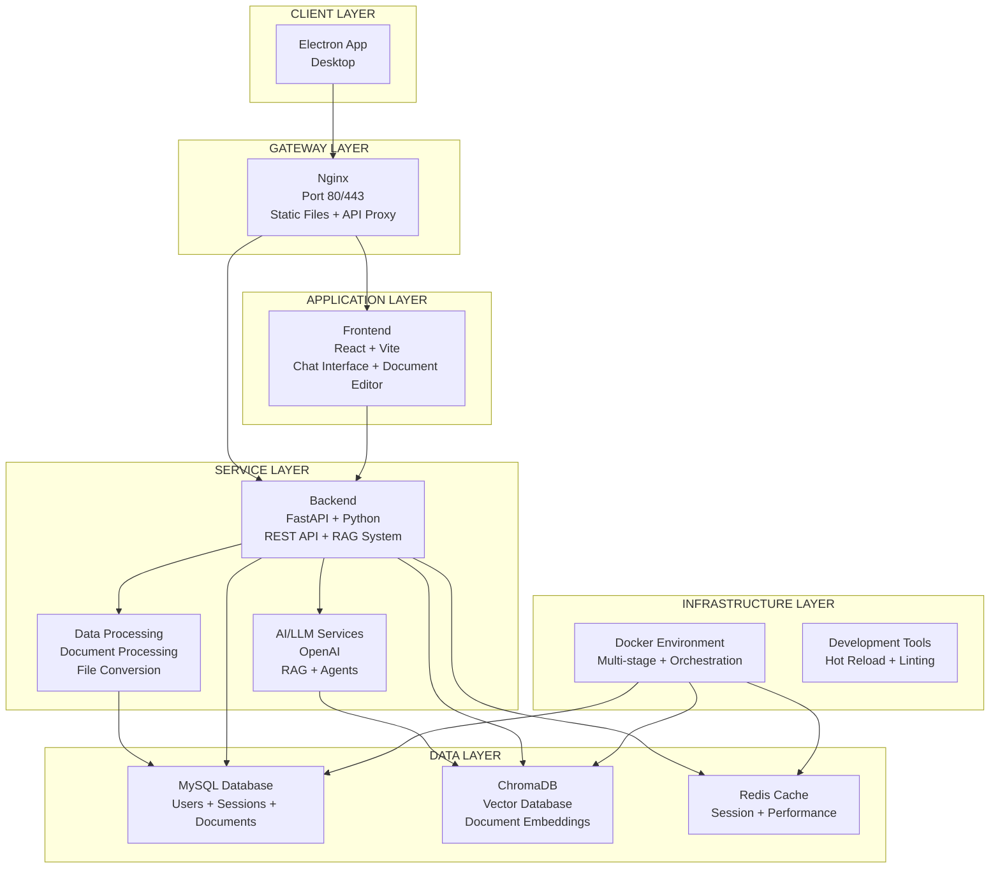
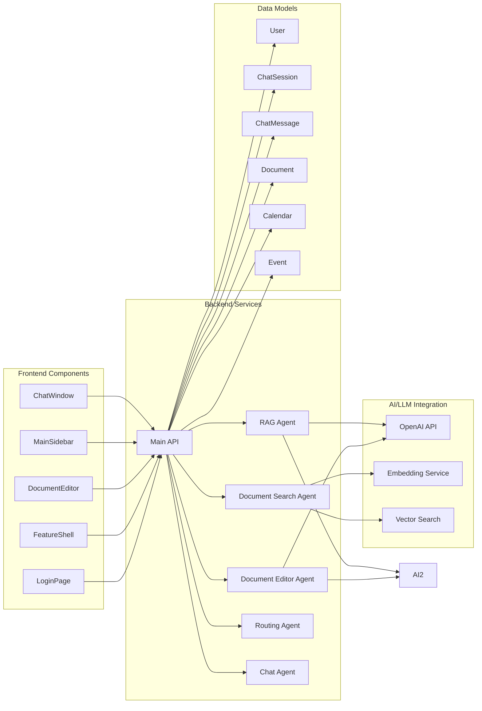

## 🏗️ CLIKCA (Click + Assistant) 시스템 아키텍처

```
┌─────────────────────────────────────────────────────────────────────────────────┐
│                              CLIENT LAYER                                      │
├─────────────────────────────────────────────────────────────────────────────────┤
│  ┌─────────────────┐    ┌─────────────────┐    ┌─────────────────┐           │
│  │   Web Browser   │    │  Electron App   │    │  Mobile App     │           │
│  │   (Port 80)     │    │   (Desktop)     │    │   (Future)      │           │
│  └─────────────────┘    └─────────────────┘    └─────────────────┘           │
└─────────────────────────────────────────────────────────────────────────────────┘
                                    │
                                    ▼
┌─────────────────────────────────────────────────────────────────────────────────┐
│                              GATEWAY LAYER                                     │
├─────────────────────────────────────────────────────────────────────────────────┤
│  ┌─────────────────────────────────────────────────────────────────────────┐   │
│  │                        Nginx (Port 80/443)                            │   │
│  │  • Static File Serving (React Build)                                  │   │
│  │  • API Proxy (Backend)                                                │   │
│  │  • Load Balancing                                                     │   │
│  │  • SSL Termination                                                    │   │
│  └─────────────────────────────────────────────────────────────────────────┘   │
└─────────────────────────────────────────────────────────────────────────────────┘
                                    │
                    ┌────────────────┼────────────────┐
                    ▼                ▼                ▼
┌─────────────────────────────────────────────────────────────────────────────────┐
│                              APPLICATION LAYER                                 │
├─────────────────────────────────────────────────────────────────────────────────┤
│  ┌─────────────────────────────────────────────────────────────────────────┐   │
│  │                    Frontend (React + Vite)                            │   │
│  │  • Chat Interface                                                     │   │
│  │  • Document Editor                                                    │   │
│  │  • Role-based UI (Admin/User)                                        │   │
│  │  • Responsive Design                                                 │   │
│  └─────────────────────────────────────────────────────────────────────────┘   │
│                                    │                                          │
│  ┌─────────────────────────────────────────────────────────────────────────┐   │
│  │                    Backend (FastAPI + Python)                          │   │
│  │  • REST API Endpoints                                                 │   │
│  │  • RAG Agent System                                                   │   │
│  │  • Document Processing                                                │   │
│  │  • Chat Management                                                    │   │
│  │  • User Authentication                                                │   │
│  └─────────────────────────────────────────────────────────────────────────┘   │
└─────────────────────────────────────────────────────────────────────────────────┘
                                    │
                    ┌────────────────┼────────────────┐
                    ▼                ▼                ▼
┌─────────────────────────────────────────────────────────────────────────────────┐
│                              SERVICE LAYER                                     │
├─────────────────────────────────────────────────────────────────────────────────┤
│  ┌─────────────────────────────────────────────────────────────────────────┐   │
│  │                        AI/LLM Services                                 │   │
│  │  • OpenAI API Integration                                             │   │
│  │  • Voyage AI Integration                                              │   │
│  │  • RAG (Retrieval-Augmented Generation)                               │   │
│  │  • Document Search Agent                                              │   │
│  │  • Document Editor Agent                                              │   │
│  │  • Routing Agent                                                      │   │
│  └─────────────────────────────────────────────────────────────────────────┘   │
│                                    │                                          │
│  ┌─────────────────────────────────────────────────────────────────────────┐   │
│  │                        Data Processing                                 │   │
│  │  • Document Upload & Processing                                       │   │
│  │  • File Format Support (PDF, DOCX, HWPX)                             │   │
│  │  • Markdown Conversion                                                │   │
│  │  • Data Extraction & Analysis                                        │   │
│  └─────────────────────────────────────────────────────────────────────────┘   │
└─────────────────────────────────────────────────────────────────────────────────┘
                                    │
                    ┌────────────────┼────────────────┐
                    ▼                ▼                ▼
┌─────────────────────────────────────────────────────────────────────────────────┐
│                              DATA LAYER                                        │
├─────────────────────────────────────────────────────────────────────────────────┤
│  ┌─────────────────────────────────────────────────────────────────────────┐   │
│  │                        MySQL Database                                  │   │
│  │  • User Management                                                    │   │
│  │  • Chat Sessions                                                      │   │
│  │  • Document Metadata                                                  │   │
│  │  • Calendar & Events                                                 │   │
│  │  • Tool Message Records                                              │   │
│  └─────────────────────────────────────────────────────────────────────────┘   │
│                                    │                                          │
│  ┌─────────────────────────────────────────────────────────────────────────┐   │
│  │                        ChromaDB (Vector DB)                            │   │
│  │  • Document Embeddings                                               │   │
│  │  • Semantic Search                                                    │   │
│  │  • RAG Indexing                                                       │   │
│  │  • Similarity Matching                                                │   │
│  └─────────────────────────────────────────────────────────────────────────┘   │
│                                    │                                          │
│  ┌─────────────────────────────────────────────────────────────────────────┐   │
│  │                        Redis Cache                                     │   │
│  │  • Session Management                                                 │   │
│  │  • Temporary Data Storage                                             │   │
│  │  • Performance Optimization                                           │   │
│  └─────────────────────────────────────────────────────────────────────────┘   │
└─────────────────────────────────────────────────────────────────────────────────┘
                                    │
                    ┌────────────────┼────────────────┐
                    ▼                ▼                ▼
┌─────────────────────────────────────────────────────────────────────────────────┐
│                              INFRASTRUCTURE LAYER                             │
├─────────────────────────────────────────────────────────────────────────────────┤
│  ┌─────────────────────────────────────────────────────────────────────────┐   │
│  │                        Docker Environment                              │   │
│  │  • Multi-stage Builds                                                 │   │
│  │  • Container Orchestration                                            │   │
│  │  • Network Isolation (skn13_network)                                  │   │
│  │  • Volume Management                                                  │   │
│  │  • Health Checks                                                      │   │
│  └─────────────────────────────────────────────────────────────────────────┘   │
│                                    │                                          │
│  ┌─────────────────────────────────────────────────────────────────────────┐   │
│  │                        Development Tools                               │   │
│  │  • Hot Reload (Development Mode)                                      │   │
│  │  • ESLint + Prettier                                                  │   │
│  │  • Tailwind CSS                                                       │   │
│  │  • Vite Build System                                                  │   │
│  └─────────────────────────────────────────────────────────────────────────┘   │
└─────────────────────────────────────────────────────────────────────────────────┘
```

## 🔧 기술 스택 상세

### **Frontend**
- **Framework**: React 19 + Vite 7
- **Styling**: Tailwind CSS
- **Icons**: React Icons, Heroicons, Lucide React
- **Markdown**: React Markdown + Remark/Rehype
- **Build**: Multi-stage Docker with Nginx

### **Backend**
- **Framework**: FastAPI (Python)
- **AI/LLM**: OpenAI API, Voyage AI
- **RAG System**: Custom Agents (Search, Editor, Routing)
- **Document Processing**: PyMuPDF, python-docx, HWPX
- **Database**: SQLAlchemy ORM

### **Data Storage**
- **Primary DB**: MySQL 8.0
- **Vector DB**: ChromaDB
- **Cache**: Redis
- **File Storage**: Local volumes

### **Infrastructure**
- **Containerization**: Docker + Docker Compose
- **Web Server**: Nginx
- **Networking**: Custom bridge network
- **Profiles**: Development/Production

## 🚀 주요 기능

1. **AI Chat Assistant**: RAG 기반 문서 검색 및 답변
2. **Document Management**: PDF, DOCX, HWPX 파일 처리
3. **Role-based Access**: Admin/User 권한 관리
4. **Multi-platform**: Web, Desktop (Electron), Mobile
5. **Real-time Processing**: Streaming responses
6. **Scalable Architecture**: Microservices with Docker

이 아키텍처는 **RAG 기반 AI 비서 시스템**으로, 문서 검색, 편집, AI 대화를 통합한 현대적인 웹 애플리케이션입니다. 🎯




