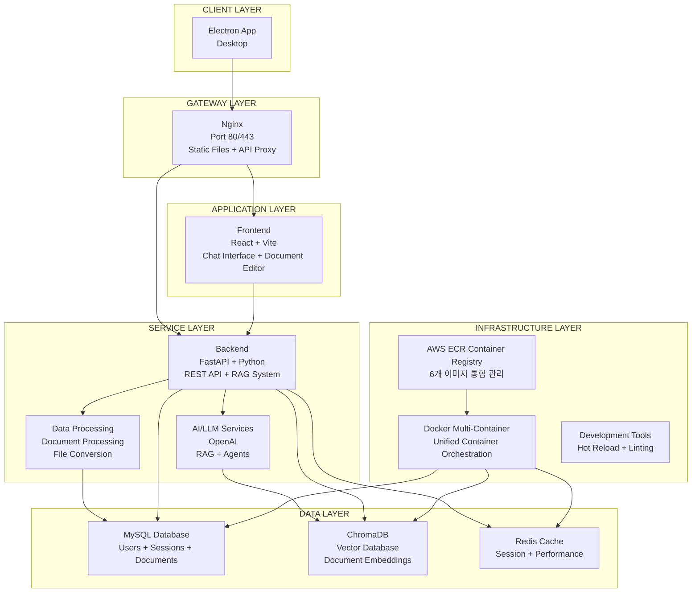
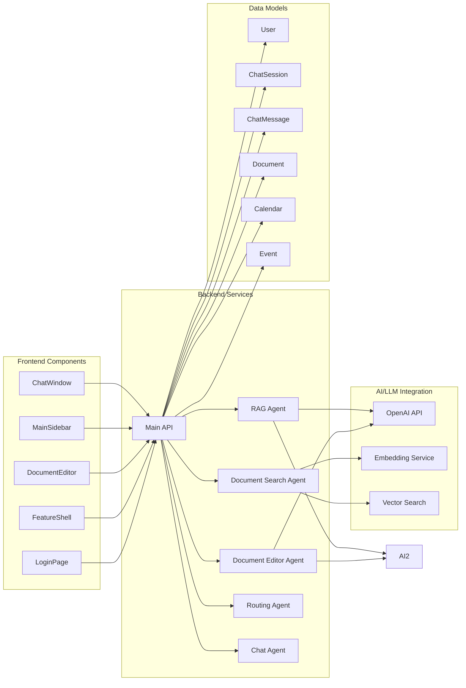

## 🏗️ CLIKCA (Click + Assistant) 시스템 아키텍처

## 🔧 기술 스택 상세

### **Frontend**
- **Framework**: React 19 + Vite 7
- **Styling**: Tailwind CSS
- **Icons**: React Icons, Heroicons, Lucide React
- **Markdown**: React Markdown + Remark/Rehype
- **Build**: Multi-stage Docker with Nginx

### **Backend**
- **Framework**: FastAPI (Python)
- **AI/LLM**: OpenAI API, Voyage AI
- **RAG System**: Custom Agents (Search, Editor, Routing)
- **Document Processing**: PyMuPDF, python-docx, HWPX
- **Database**: SQLAlchemy ORM

### **Data Storage**
- **Primary DB**: MySQL 8.0
- **Vector DB**: ChromaDB
- **Cache**: Redis
- **File Storage**: Local volumes

### **Infrastructure**
- **Containerization**: Docker + Docker Compose
- **Web Server**: Nginx
- **Networking**: Custom bridge network
- **Profiles**: Development/Production

## 🚀 주요 기능

1. **AI Chat Assistant**: RAG 기반 문서 검색 및 답변
2. **Document Management**: PDF, DOCX, HWPX 파일 처리
3. **Role-based Access**: Admin/User 권한 관리
4. **Multi-platform**: Web, Desktop (Electron), Mobile
5. **Real-time Processing**: Streaming responses
6. **Scalable Architecture**: Microservices with Docker & AWS ECR

이 아키텍처는 **RAG 기반 AI 비서 시스템**으로, 문서 검색, 편집, AI 대화를 통합한 현대적인 웹 애플리케이션입니다. AWS ECR을 통해 6개의 독립적인 이미지를 하나의 통합된 컨테이너 환경으로 관리하여 배포와 운영을 효율화합니다. 🎯

**AWS ECR 통합 컨테이너 구성:**
- **Frontend Container**: React + Vite 기반 사용자 인터페이스
- **Backend Container**: FastAPI + Python 기반 REST API 서버
- **AI Service Container**: OpenAI API 연동 및 RAG 시스템
- **Database Container**: MySQL 데이터베이스 서버
- **Vector DB Container**: ChromaDB 벡터 데이터베이스
- **Cache Container**: Redis 세션 및 성능 캐시

