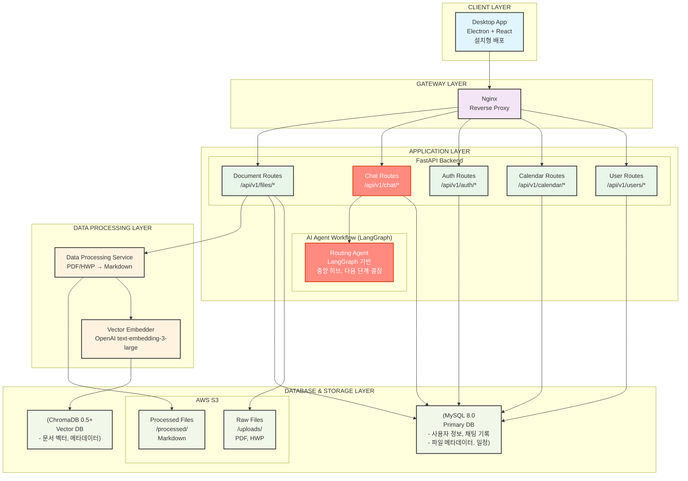
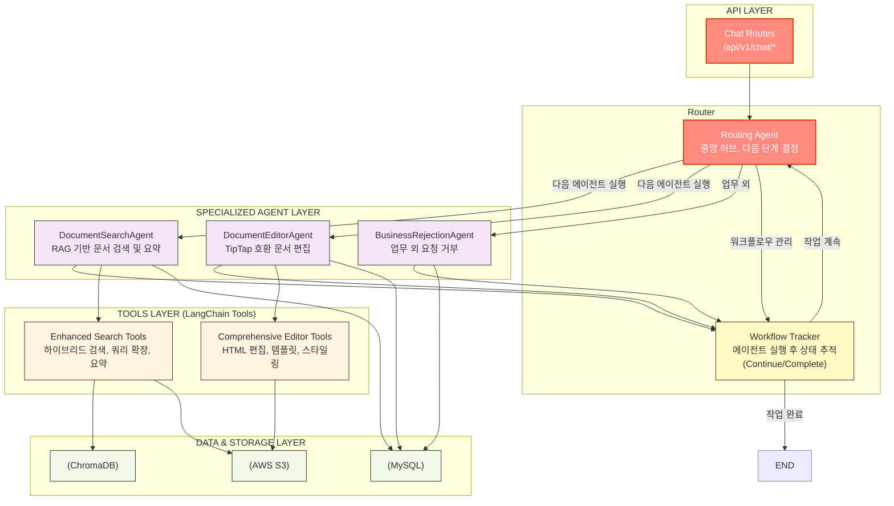
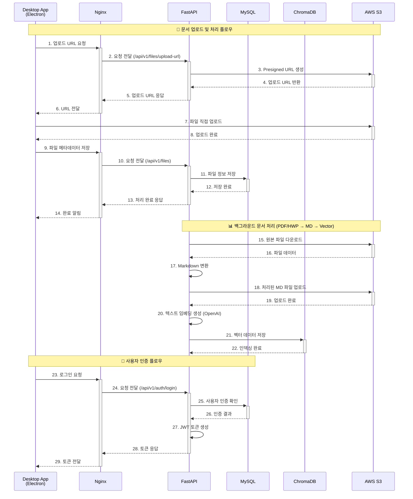
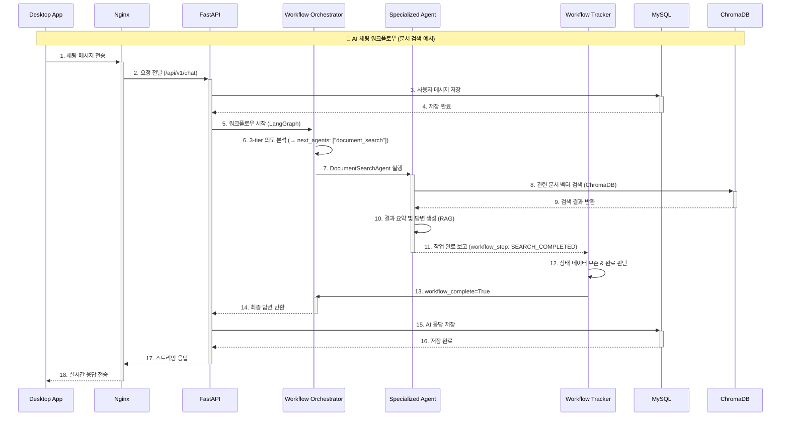
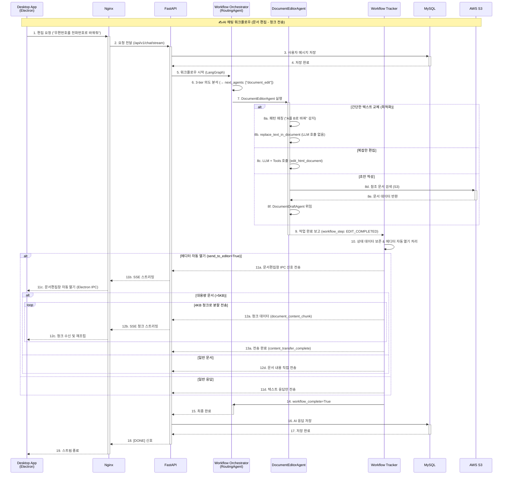
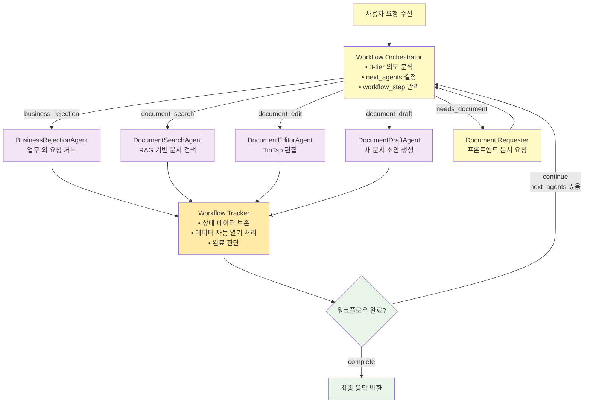
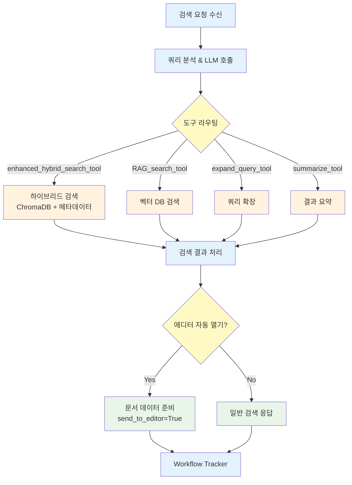
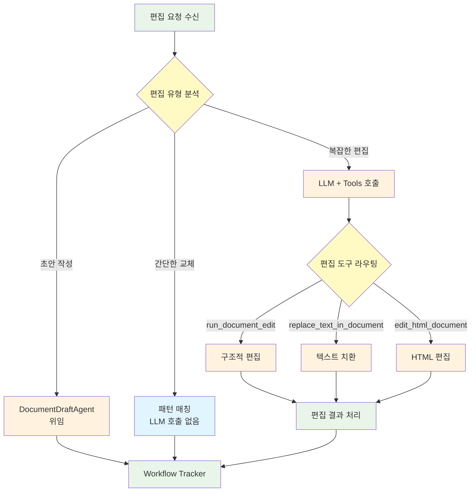

# CLIKCA 시스템 아키텍처

## 📋 개요

본 문서는 CLIKCA 시스템의 전체 아키텍처, 새로 도입된 **다단계 AI 워크플로우(Multi-Step AI Workflow)**, 각 구성 요소 간의 상호작용, 데이터 흐름, 그리고 기술 스택을 상세히 기술한 시스템 구성도입니다. 주요 목표는 복잡한 사용자 요청을 지능적으로 분석하고, 여러 AI 에이전트를 체계적으로 오케스트레이션하여 `검색 → 분석 → 편집`과 같은 다단계 작업을 자동으로 처리하는 것입니다.

---

## 🏗️ 전체 시스템 아키텍처

### 1. 시스템 구성도

---

## 🤖 AI 에이전트 워크플로우 상세

### 1. Multi-Step Workflow 아키텍처 (LangGraph 기반)

새로운 아키텍처는 **`MultiStepWorkflowGraph`** 를 중심으로 구성됩니다. 이 그래프는 단순한 의도 분류를 넘어, 여러 AI 에이전트를 순차적 또는 조건부로 실행하여 복잡한 작업을 해결합니다.

### 2. Sequence Diagram

#### 2.1. 문서 처리 및 인증

#### 2.2. AI 채팅 (문서 검색 예시)

#### 2.3. AI 채팅 (문서 편집 예시)

### 3. 새로운 워크플로우 구조

#### 3-1. 워크플로우 오케스트레이터 (실제 LangGraph 노드 구조)

#### 3-2. DocumentSearchAgent (핵심 라우팅 구조)

#### 3-3. DocumentEditorAgent (핵심 라우팅 구조)

---

### 4. 주요 변경사항 및 특징 (2025년 현재 구현)

- **비활성화된 에이전트**:
  - `GeneralChatAgent`: 업무와 무관한 대화는 `BusinessRejectionAgent`가 처리하도록 통합하여 시스템의 전문성을 강화했습니다.
  - `DocumentSelectionAgent`: 프론트엔드에서 사용자가 직접 문서를 선택하는 방식으로 UX가 변경됨에 따라, 백엔드에서의 선택 에이전트는 불필요해졌습니다.

- **핵심 컴포넌트**:
  - **Workflow Orchestrator**: `RoutingAgent`를 기반으로 하며, 전체 워크플로우의 두뇌 역할을 합니다. 사용자 요청을 분석하여 필요한 에이전트들의 실행 순서를 결정하고, `Workflow Tracker`와 상호작용하며 작업 흐름을 제어합니다.
  - **Workflow Tracker**: 각 에이전트의 실행이 끝난 후, 워크플로우가 계속 진행되어야 하는지(`continue`), 아니면 모든 작업이 완료되었는지(`complete`)를 판단하여 오케스트레이터에게 피드백을 제공합니다.

- **최적화된 DocumentEditorAgent**:
  - **간단한 텍스트 교체 최적화**: "A를 B로 바꿔줘" 패턴을 regex로 감지하여 LLM 호출 없이 즉시 처리
  - **초안 작성 기능**: S3의 참조 문서들을 분석하여 새로운 연도 문서 자동 생성
  - **Strategy Pattern 도구 구조**: 1061줄 스파게티 코드를 전략 패턴으로 리팩토링하여 유지보수성 향상

- **대용량 문서 전송 시스템**:
  - **청크 기반 SSE 전송**: 5KB 이상 문서를 4KB 단위로 분할하여 안전한 전송
  - **JSON 파싱 오류 해결**: 대용량 JSON 데이터의 SSE 전송 시 발생하는 파싱 오류 완전 해결
  - **문서 자동 재조립**: 프론트엔드에서 청크들을 자동으로 재조립하여 완전한 문서 복원

- **IPC 통신 강화**:
  - **문서편집창 자동 열기**: 백엔드에서 편집 완료 시 Electron IPC를 통해 자동으로 문서편집창 열기
  - **실시간 문서 업데이트**: SSE를 통한 실시간 문서 내용 업데이트 및 동기화

- **상태 관리 (`AgentState`)**: LangGraph의 `StateGraph`를 통해 워크플로우의 모든 상태(사용자 입력, 현재 문서, 대화 기록, 다음 실행할 에이전트 목록 등)가 중앙에서 관리되어 데이터 흐름의 일관성을 보장합니다.

- **에러 처리 개선**:
  - **re 모듈 import 문제**: 모든 에이전트에서 regex 사용 시 발생하는 import 오류 완전 해결
  - **포괄적 예외 처리**: 각 단계별 상세한 에러 로깅 및 사용자 친화적 오류 메시지

---

## 📄 엔드포인트 및 서비스 기능

| 라우터 | 엔드포인트 | HTTP 메소드 | 주요 기능 |
|---|---|---|---|
| **Auth** | `/api/v1/auth/login` | POST | 사용자 로그인 및 JWT 토큰 발급 |
| | `/api/v1/auth/signup` | POST | 회원가입 |
| **Users** | `/api/v1/users/me` | GET | 현재 사용자 정보 조회 |
| **Files** | `/api/v1/files/upload-url` | GET | AWS S3 Presigned URL 생성 (파일 업로드용) |
| | `/api/v1/files/` | GET | 업로드된 파일 목록 조회 |
| | `/api/v1/files/{file_id}` | GET | 특정 파일 정보 및 내용 조회 |
| **Chat** | `/api/v1/chat/` | POST | AI 에이전트 워크플로우 시작 및 채팅 응답 (스트리밍) |
| **Calendar**| `/api/v1/calendar/events` | GET, POST | 캘린더 이벤트 조회 및 생성 |