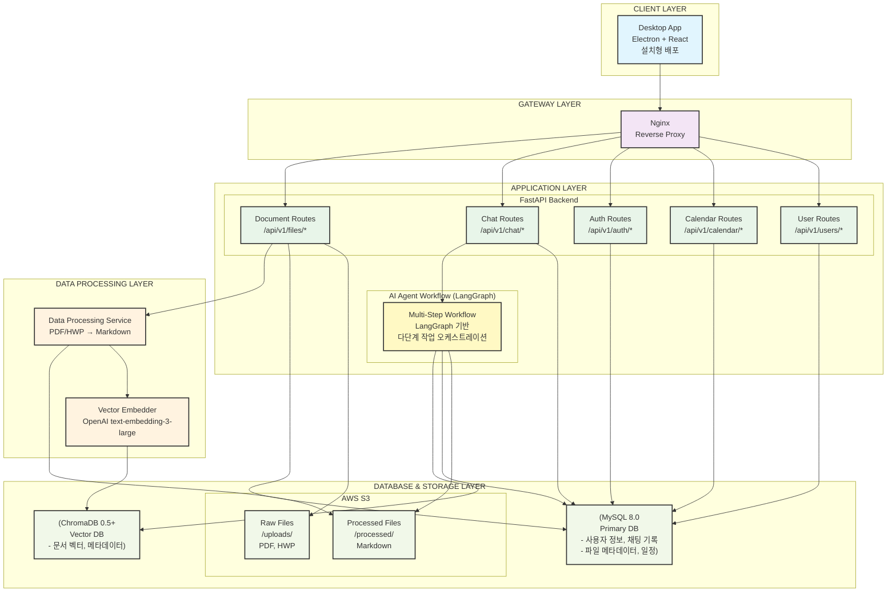
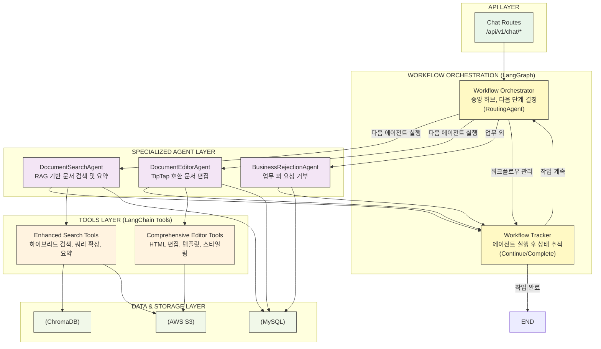
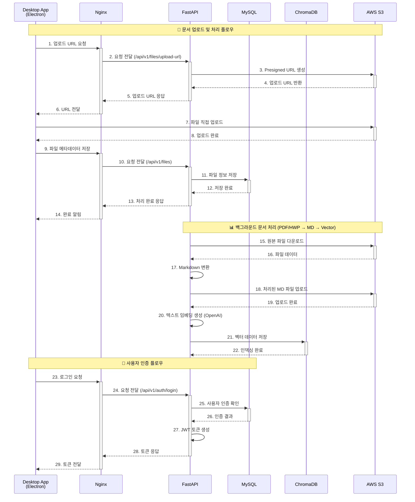
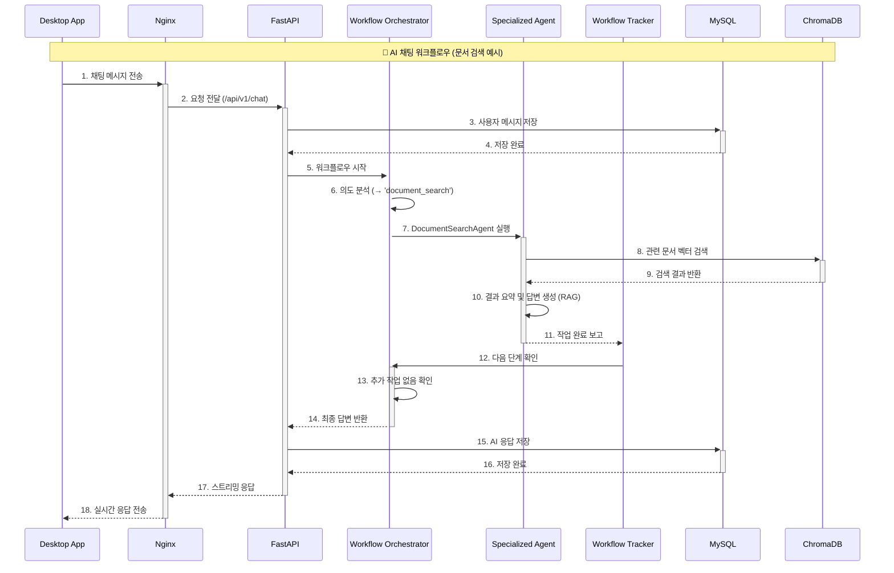
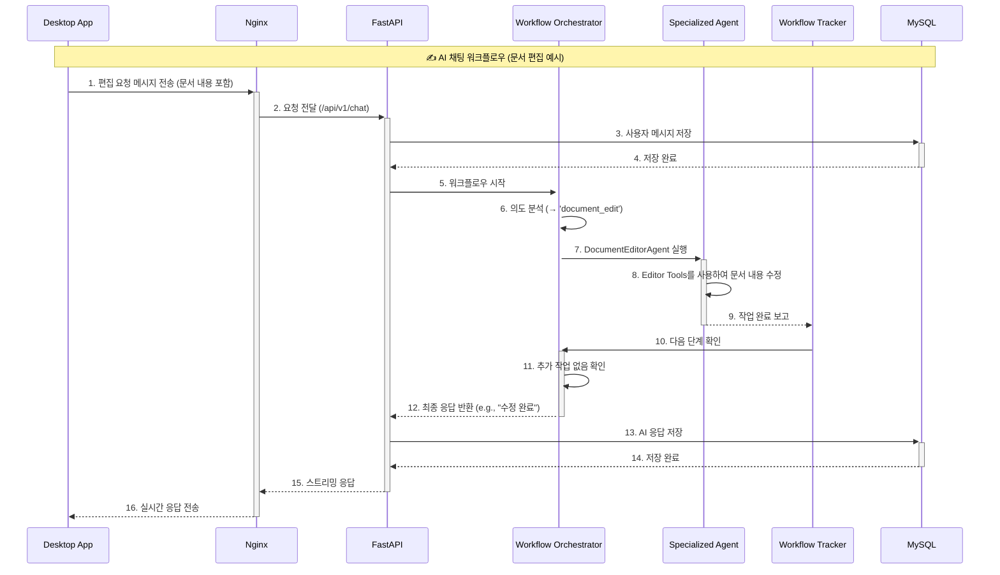

# CLIKCA 시스템 아키텍처

## 📋 개요

본 문서는 CLIKCA 시스템의 전체 아키텍처, 새로 도입된 **다단계 AI 워크플로우(Multi-Step AI Workflow)**, 각 구성 요소 간의 상호작용, 데이터 흐름, 그리고 기술 스택을 상세히 기술한 시스템 구성도입니다. 주요 목표는 복잡한 사용자 요청을 지능적으로 분석하고, 여러 AI 에이전트를 체계적으로 오케스트레이션하여 `검색 → 분석 → 편집`과 같은 다단계 작업을 자동으로 처리하는 것입니다.

---

## 🏗️ 전체 시스템 아키텍처

### 1. 시스템 구성도

### 2. 기술 스택 및 버전

| 구분 | 기술 | 버전 | 목적 |
|---|---|---|---|
| **Frontend** | React | 18.2.0 | UI/UX 구축 |
| | Electron | 31.0.2 | 데스크톱 앱 패키징 |
| **Backend** | FastAPI | 0.111.0 | API 서버 구축 |
| | Python | 3.11 | 주력 개발 언어 |
| **AI/LLM** | LangChain | 0.2.5 | AI 에이전트 및 도구 개발 |
| | LangGraph | 0.0.65 | 다단계 워크플로우 관리 |
| | OpenAI API | GPT-4o | 핵심 LLM 모델 |
| **Database** | MySQL | 8.0 | RDB (사용자, 채팅, 메타데이터) |
| | ChromaDB | 0.5.0 | Vector DB (문서 임베딩 저장) |
| **Infra** | Docker | 26.1.3 | 컨테이너화 및 배포 |
| | Nginx | 1.25.3 | 리버스 프록시, 로드 밸런싱 |
| | AWS S3 | - | 파일 스토리지 (원본, 처리 데이터) |

---

## 🤖 AI 에이전트 워크플로우 상세

### 1. Multi-Step Workflow 아키텍처 (LangGraph 기반)

새로운 아키텍처는 **`MultiStepWorkflowGraph`** 를 중심으로 구성됩니다. 이 그래프는 단순한 의도 분류를 넘어, 여러 AI 에이전트를 순차적 또는 조건부로 실행하여 복잡한 작업을 해결합니다.

### 2. 워크플로우 상세 흐름 (Sequence Diagram)

#### 2.1. 문서 처리 및 인증

#### 2.2. AI 채팅 워크플로우 (문서 검색 예시)

#### 2.3. AI 채팅 워크플로우 (문서 편집 예시)

### 3. 주요 변경사항 및 특징

- **비활성화된 에이전트**:
  - `GeneralChatAgent`: 업무와 무관한 대화는 `BusinessRejectionAgent`가 처리하도록 통합하여 시스템의 전문성을 강화했습니다.
  - `DocumentSelectionAgent`: 프론트엔드에서 사용자가 직접 문서를 선택하는 방식으로 UX가 변경됨에 따라, 백엔드에서의 선택 에이전트는 불필요해졌습니다.
- **핵심 컴포넌트**:
  - **Workflow Orchestrator**: `RoutingAgent`를 기반으로 하며, 전체 워크플로우의 두뇌 역할을 합니다. 사용자 요청을 분석하여 필요한 에이전트들의 실행 순서를 결정하고, `Workflow Tracker`와 상호작용하며 작업 흐름을 제어합니다.
  - **Workflow Tracker**: 각 에이전트의 실행이 끝난 후, 워크플로우가 계속 진행되어야 하는지(`continue`), 아니면 모든 작업이 완료되었는지(`complete`)를 판단하여 오케스트레이터에게 피드백을 제공합니다.
- **상태 관리 (`AgentState`)**: LangGraph의 `StateGraph`를 통해 워크플로우의 모든 상태(사용자 입력, 현재 문서, 대화 기록, 다음 실행할 에이전트 목록 등)가 중앙에서 관리되어 데이터 흐름의 일관성을 보장합니다.

---

## 📄 엔드포인트 및 서비스 기능

| 라우터 | 엔드포인트 | HTTP 메소드 | 주요 기능 |
|---|---|---|---|
| **Auth** | `/api/v1/auth/login` | POST | 사용자 로그인 및 JWT 토큰 발급 |
| | `/api/v1/auth/signup` | POST | 회원가입 |
| **Users** | `/api/v1/users/me` | GET | 현재 사용자 정보 조회 |
| **Files** | `/api/v1/files/upload-url` | GET | AWS S3 Presigned URL 생성 (파일 업로드용) |
| | `/api/v1/files/` | GET | 업로드된 파일 목록 조회 |
| | `/api/v1/files/{file_id}` | GET | 특정 파일 정보 및 내용 조회 |
| **Chat** | `/api/v1/chat/` | POST | AI 에이전트 워크플로우 시작 및 채팅 응답 (스트리밍) |
| **Calendar**| `/api/v1/calendar/events` | GET, POST | 캘린더 이벤트 조회 및 생성 |
