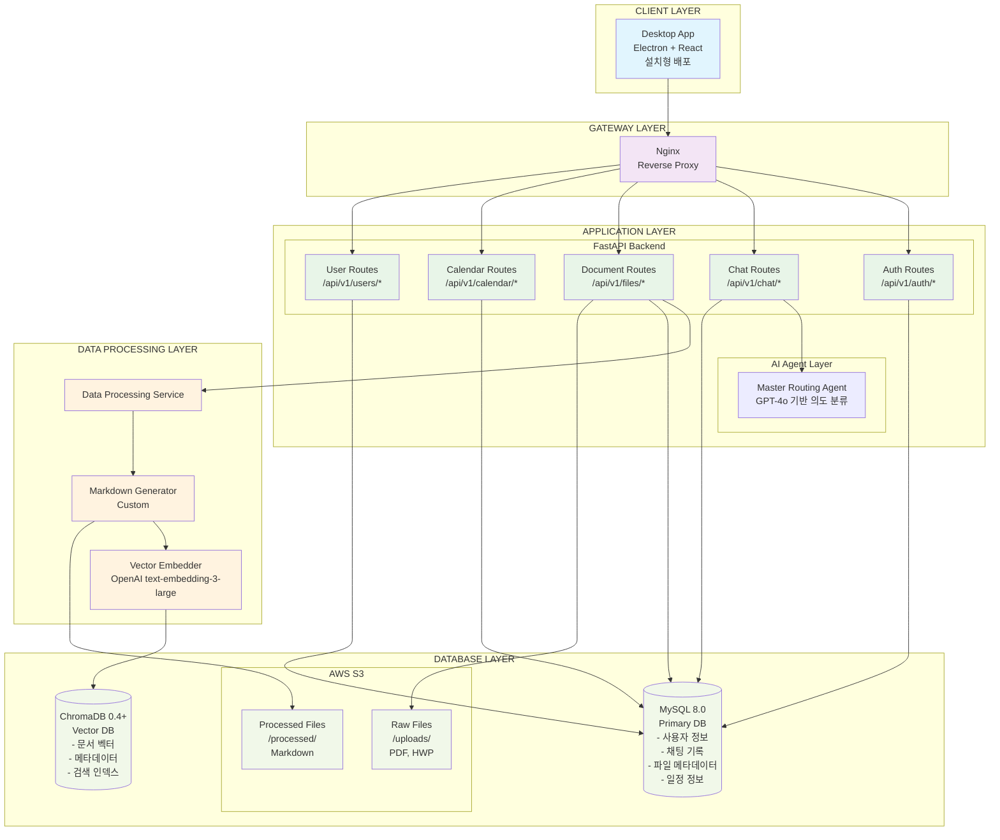
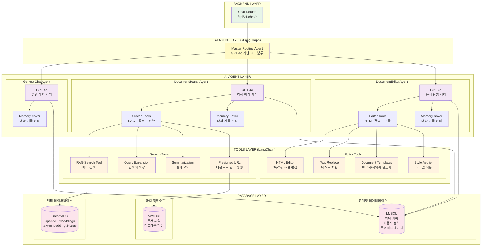
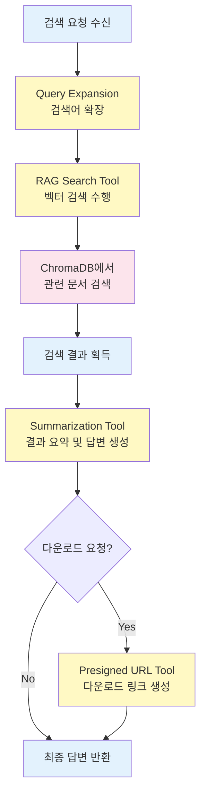
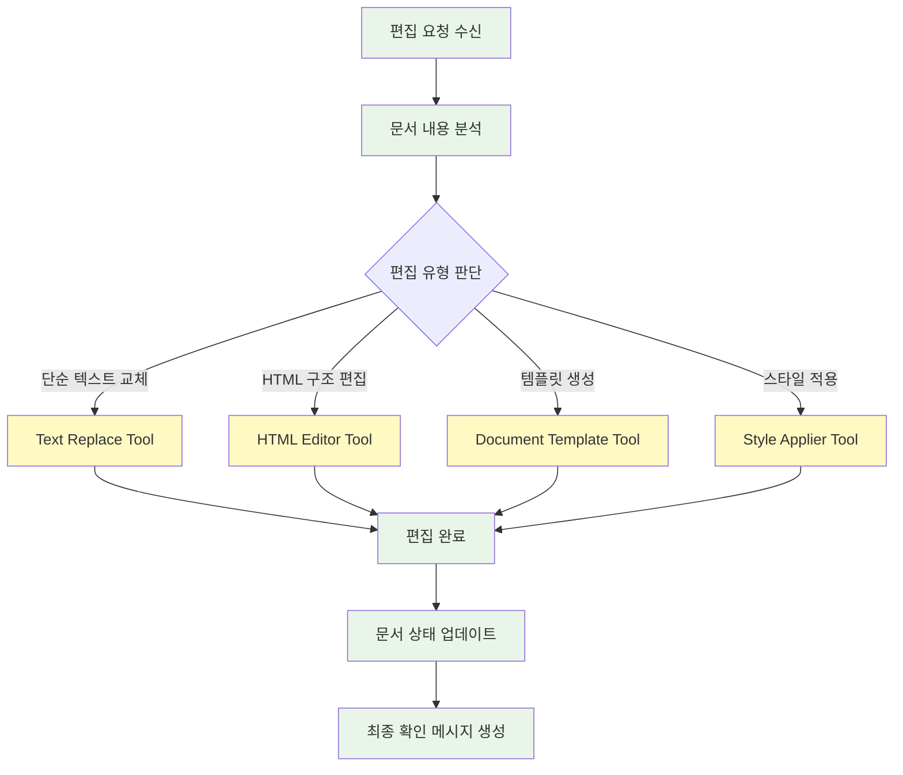
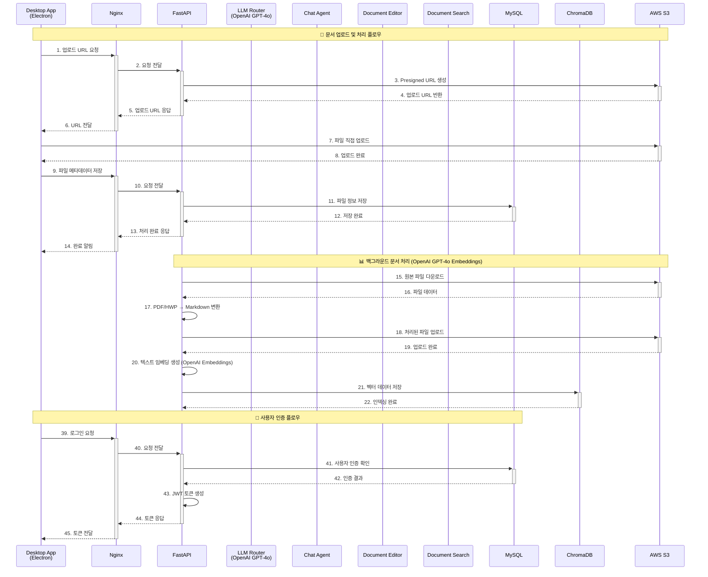
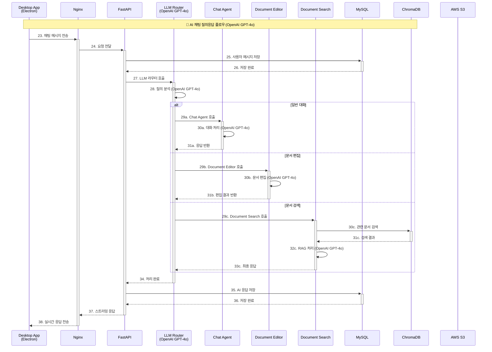

# CLIKCA 시스템 인터렉션 아키텍처

## 📋 개요

본 문서는 CLIKCA 시스템의 시스템 아키텍처, AI Agent 구조와 각 에이전트 간의 상호작용, 데이터 흐름도, 도구 사용 패턴, 그리고 전체적인 워크플로우를 상세히 분석한 아키텍처 다이어그램입니다.

---

## 🏗️ 시스템 구성

### 1. 시스템 아키텍처



### 2. AI Agent Router 상세 시스템 아키텍처



### 3. DocumentSearchAgent 워크플로우



### 4. DocumentEditorAgent 워크플로우



### 5. Sequence diagram

#### 1. 문서 처리, 인증



#### 2. 채팅 



---

## 🛠️ 도구(Tools) 상세 분석

### 검색 관련 도구들

| 도구명 | 기능 | 입력 | 출력 |
|--------|------|------|------|
| **RAG Search Tool** | ChromaDB 벡터 검색 | 키워드 리스트 | 관련 문서 청크 |
| **Query Expansion** | 검색어 확장 및 개선 | 원본 쿼리 | 확장된 쿼리들 |
| **Route Query** | 후속질문 vs 신규검색 판단 | 대화 상태 | 라우팅 결정 |
| **Handle Follow Up** | 후속 질문 처리 | 대화 상태 | 상태 유지 |
| **Summarization** | 검색 결과 요약 | 문서 + 쿼리 | 최종 답변 |
| **Presigned URL** | S3 다운로드 링크 생성 | 파일 키 | 다운로드 URL |

### 편집 관련 도구들

| 도구명 | 기능 | TipTap 호환성 |
|--------|------|---------------|
| **HTML Editor** | 구조적 HTML 편집 | ✅ 완전 호환 |
| **Text Replace** | 단순 텍스트 치환 | ✅ 호환 |
| **Document Templates** | 보고서/회의록 템플릿 | ✅ 호환 |
| **Formatted Text** | 스타일 적용 (굵게, 이탤릭 등) | ✅ 호환 |
| **List Creator** | 순서/비순서 리스트 생성 | ✅ 호환 |
| **Table Creator** | 테이블 생성 및 스타일링 | ✅ 호환 |
| **Blockquote** | 인용문/들여쓰기 | ✅ 호환 |
| **Style Applier** | CSS 스타일 적용 | ✅ 호환 |

---

## 🔧 상태 관리 (AgentState)

```typescript
interface AgentState {
    prompt: string                    // 사용자 입력
    document_content?: string         // 편집 대상 문서
    messages: BaseMessage[]           // 대화 기록 (LangGraph 관리)
    intent: string                   // 라우팅 결과
    needs_document_content: boolean   // 문서 요청 필요 여부
    intermediate_steps: any[]         // 중간 처리 결과
    generation?: string               // 최종 생성 답변
}
```

### 상태 흐름

1. **초기 상태**: 사용자 메시지와 기본 설정
2. **라우팅 단계**: `intent` 필드에 라우팅 결과 저장
3. **문서 처리**: `document_content` 필드 업데이트
4. **도구 실행**: `intermediate_steps`에 중간 결과 누적
5. **최종 응답**: `generation` 필드에 최종 답변 저장

---

## 📈 확장성 고려사항

### 1. 새로운 에이전트 추가
- **라우팅 로직** 수정으로 새 에이전트 통합 가능
- **플러그인 구조**: 독립적인 에이전트 개발

### 2. 도구 확장
- **LangChain Tool** 인터페이스 준수
- **타입 안정성**: Pydantic 모델 활용

### 3. 다중 LLM 지원
- **추상화 계층**: LLM 교체 용이
- **모델별 최적화**: 용도에 따른 모델 선택

