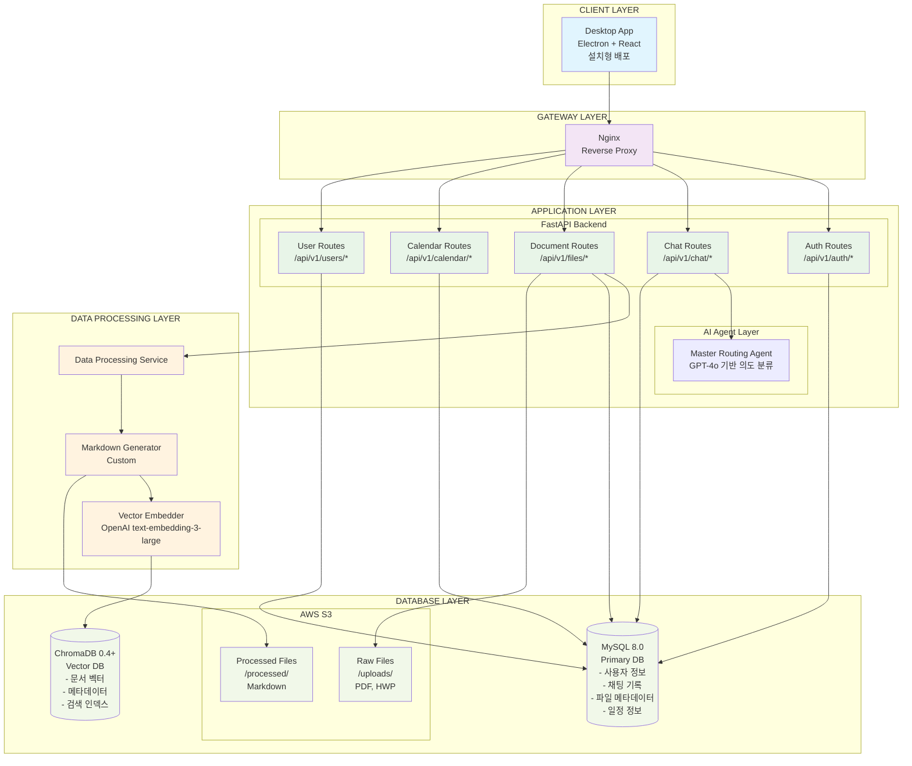
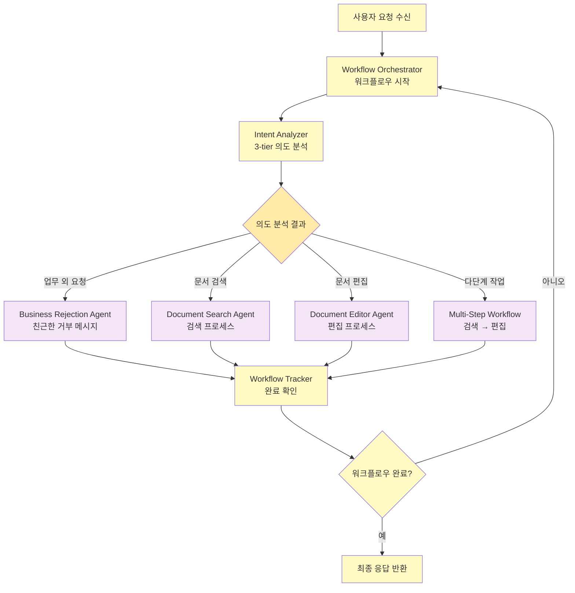
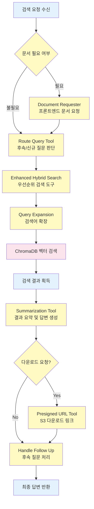
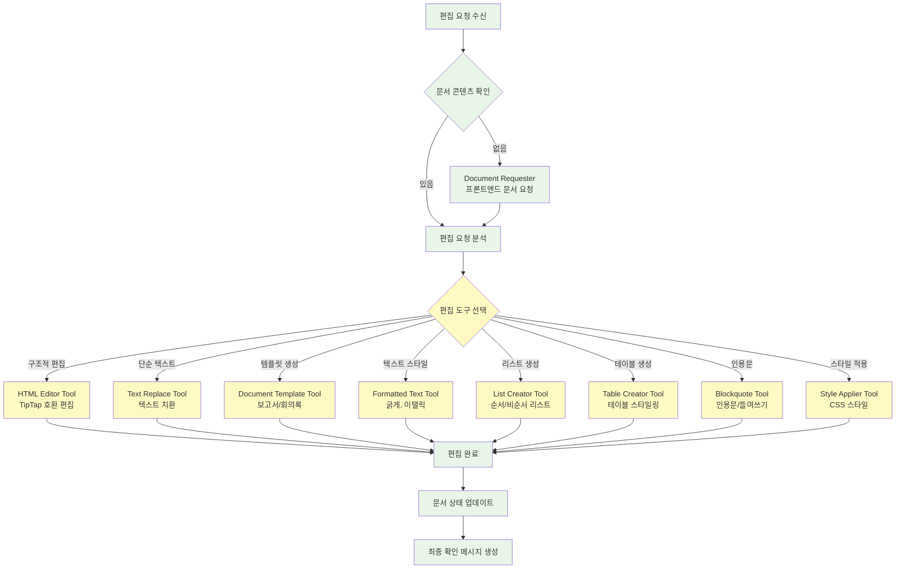
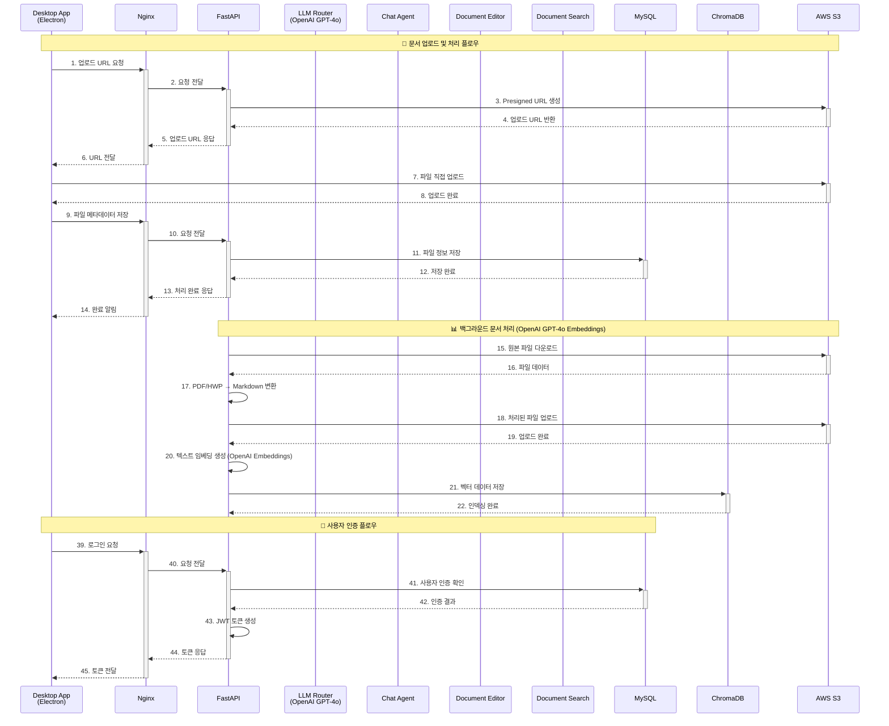
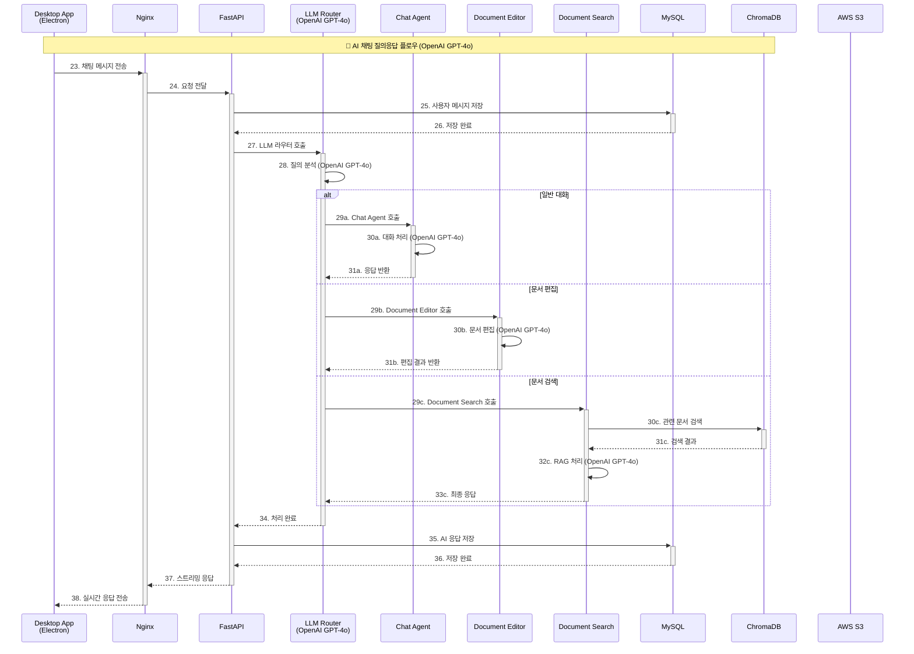

# CLIKCA 시스템 인터렉션 아키텍처

## 📋 개요

본 문서는 CLIKCA 시스템의 시스템 아키텍처, AI Agent 구조와 각 에이전트 간의 상호작용, 데이터 흐름도, 도구 사용 패턴, 그리고 전체적인 워크플로우를 상세히 분석한 아키텍처 다이어그램입니다.

---

## 🏗️ 시스템 구성

### 1. 시스템 아키텍처



### 2. AI Agent Router 상세 시스템 아키텍처

```mermaid
graph TB

    %% API 계층
    subgraph "BACKEND LAYER"
        CHAT_ROUTER[Chat Routes<br/>/api/v1/chat/*]
    end

    %% 워크플로우 오케스트레이터 계층
    subgraph "WORKFLOW ORCHESTRATION (LangGraph)"
        ORCHESTRATOR[Workflow Orchestrator<br/>다단계 워크플로우 관리]
        INTENT_ANALYZER[Intent Analyzer<br/>3-tier 의도 분석<br/>Rule → Pattern → LLM]
        WORKFLOW_TRACKER[Workflow Tracker<br/>워크플로우 완료 추적]
        DOC_REQUESTER[Document Requester<br/>프론트엔드 문서 요청]
    end

    %% 전문 에이전트 계층
    subgraph "SPECIALIZED AGENT LAYER"
        subgraph "BusinessRejectionAgent"
            REJECTION_LLM[GPT-4o<br/>업무 외 요청 거부<br/>친근한 안내 메시지]
        end
        
        subgraph "DocumentSearchAgent"
            SEARCH_LLM[GPT-4o<br/>문서 검색 및 RAG 처리]
            SEARCH_TOOLS[Enhanced Search Tools<br/>하이브리드 검색 + 쿼리 확장<br/>결과 요약 + Presigned URL]
        end
        
        subgraph "DocumentEditorAgent"
            EDITOR_LLM[GPT-4o<br/>TipTap 호환 문서 편집]
            EDITOR_TOOLS[Editor Tools (1061줄)<br/>HTML/텍스트 편집<br/>템플릿 + 스타일링]
        end
    end

    %% 도구 계층 (Tools Layer)
    subgraph "TOOLS LAYER (LangChain)"
        subgraph "Enhanced Search Tools"
            ENHANCED_HYBRID[Enhanced Hybrid Search<br/>우선순위 도구]
            RAG_TOOL[RAG Search Tool<br/>벡터 검색]
            LOCAL_DOC_SEARCH[Local Document Search<br/>로컬 문서 검색]
            HYBRID_DOC_SEARCH[Hybrid Document Search<br/>하이브리드 검색]
            QUERY_EXPAND[Query Expansion<br/>검색어 확장]
            ROUTE_QUERY[Route Query<br/>후속/신규 질문 판단]
            HANDLE_FOLLOWUP[Handle Follow Up<br/>후속 질문 처리]
            SUMMARIZE[Summarization<br/>결과 요약]
            PRESIGNED_URL[Presigned URL<br/>S3 다운로드 링크]
        end
        
        subgraph "Comprehensive Editor Tools"
            HTML_EDITOR[HTML Editor<br/>구조적 HTML 편집]
            TEXT_REPLACE[Text Replace<br/>단순 텍스트 치환]
            DOC_TEMPLATE[Document Templates<br/>보고서/회의록 템플릿]
            FORMATTED_TEXT[Formatted Text<br/>굵게, 이탤릭 등]
            LIST_CREATOR[List Creator<br/>순서/비순서 리스트]
            TABLE_CREATOR[Table Creator<br/>테이블 생성 스타일링]
            BLOCKQUOTE[Blockquote<br/>인용문/들여쓰기]
            STYLE_APPLY[Style Applier<br/>CSS 스타일 적용]
        end
    end

    %% 데이터 계층
    subgraph "DATABASE LAYER"
        subgraph "벡터 데이터베이스"
            CHROMADB[(ChromaDB<br/>OpenAI Embeddings<br/>text-embedding-3-large)]
        end
        
        subgraph "관계형 데이터베이스"
            MYSQL[(MySQL<br/>채팅 기록<br/>사용자 정보<br/>문서 메타데이터)]
        end
        
        subgraph "파일 저장소"
            S3[(AWS S3<br/>문서 파일<br/>마크다운 파일)]
        end
    end

    %% 연결 관계 정의
    
    CHAT_ROUTER --> ORCHESTRATOR
    
    %% 오케스트레이터 내부 플로우
    ORCHESTRATOR --> INTENT_ANALYZER
    ORCHESTRATOR --> WORKFLOW_TRACKER
    ORCHESTRATOR --> DOC_REQUESTER
    
    %% 의도 분석 결과에 따른 에이전트 라우팅
    INTENT_ANALYZER --> REJECTION_LLM
    INTENT_ANALYZER --> SEARCH_LLM
    INTENT_ANALYZER --> EDITOR_LLM
    
    %% 문서 검색 에이전트 도구 연결
    SEARCH_LLM --> SEARCH_TOOLS
    SEARCH_TOOLS --> ENHANCED_HYBRID
    SEARCH_TOOLS --> RAG_TOOL
    SEARCH_TOOLS --> LOCAL_DOC_SEARCH
    SEARCH_TOOLS --> HYBRID_DOC_SEARCH
    SEARCH_TOOLS --> QUERY_EXPAND
    SEARCH_TOOLS --> ROUTE_QUERY
    SEARCH_TOOLS --> HANDLE_FOLLOWUP
    SEARCH_TOOLS --> SUMMARIZE
    SEARCH_TOOLS --> PRESIGNED_URL
    
    %% 문서 편집 에이전트 도구 연결
    EDITOR_LLM --> EDITOR_TOOLS
    EDITOR_TOOLS --> HTML_EDITOR
    EDITOR_TOOLS --> TEXT_REPLACE
    EDITOR_TOOLS --> DOC_TEMPLATE
    EDITOR_TOOLS --> FORMATTED_TEXT
    EDITOR_TOOLS --> LIST_CREATOR
    EDITOR_TOOLS --> TABLE_CREATOR
    EDITOR_TOOLS --> BLOCKQUOTE
    EDITOR_TOOLS --> STYLE_APPLY
    
    %% 도구들과 데이터 소스 연결
    ENHANCED_HYBRID --> CHROMADB
    RAG_TOOL --> CHROMADB
    LOCAL_DOC_SEARCH --> CHROMADB
    HYBRID_DOC_SEARCH --> CHROMADB
    PRESIGNED_URL --> S3
    
    %% 모든 에이전트는 MySQL에 대화 기록 저장
    REJECTION_LLM --> MYSQL
    SEARCH_LLM --> MYSQL
    EDITOR_LLM --> MYSQL
    
    %% 스타일링

    classDef apiLayer fill:#e8f5e8
    classDef orchestrationLayer fill:#fff9c4
    classDef agentLayer fill:#f3e5f5
    classDef toolLayer fill:#fff3e0
    classDef dataLayer fill:#fce4ec

    class CHAT_ROUTER apiLayer
    class ORCHESTRATOR,INTENT_ANALYZER,WORKFLOW_TRACKER,DOC_REQUESTER orchestrationLayer
    class REJECTION_LLM,SEARCH_LLM,EDITOR_LLM agentLayer
    class ENHANCED_HYBRID,RAG_TOOL,LOCAL_DOC_SEARCH,HYBRID_DOC_SEARCH,QUERY_EXPAND,ROUTE_QUERY,HANDLE_FOLLOWUP,SUMMARIZE,PRESIGNED_URL,HTML_EDITOR,TEXT_REPLACE,DOC_TEMPLATE,FORMATTED_TEXT,LIST_CREATOR,TABLE_CREATOR,BLOCKQUOTE,STYLE_APPLY toolLayer
    class CHROMADB,MYSQL,S3 dataLayer
```

### 3. 새로운 워크플로우 구조

#### 3-1. 워크플로우 오케스트레이터 플로우



#### 3-2. DocumentSearchAgent 개선된 워크플로우



#### 3-3. DocumentEditorAgent 개선된 워크플로우



### 5. Sequence diagram

#### 1. 문서 처리, 인증



#### 2. 채팅 



---

## 🛠️ 도구(Tools) 상세 분석

### 검색 관련 도구들

| 도구명 | 기능 | 입력 | 출력 |
|--------|------|------|------|
| **RAG Search Tool** | ChromaDB 벡터 검색 | 키워드 리스트 | 관련 문서 청크 |
| **Query Expansion** | 검색어 확장 및 개선 | 원본 쿼리 | 확장된 쿼리들 |
| **Route Query** | 후속질문 vs 신규검색 판단 | 대화 상태 | 라우팅 결정 |
| **Handle Follow Up** | 후속 질문 처리 | 대화 상태 | 상태 유지 |
| **Summarization** | 검색 결과 요약 | 문서 + 쿼리 | 최종 답변 |
| **Presigned URL** | S3 다운로드 링크 생성 | 파일 키 | 다운로드 URL |

### 편집 관련 도구들

| 도구명 | 기능 | TipTap 호환성 |
|--------|------|---------------|
| **HTML Editor** | 구조적 HTML 편집 | ✅ 완전 호환 |
| **Text Replace** | 단순 텍스트 치환 | ✅ 호환 |
| **Document Templates** | 보고서/회의록 템플릿 | ✅ 호환 |
| **Formatted Text** | 스타일 적용 (굵게, 이탤릭 등) | ✅ 호환 |
| **List Creator** | 순서/비순서 리스트 생성 | ✅ 호환 |
| **Table Creator** | 테이블 생성 및 스타일링 | ✅ 호환 |
| **Blockquote** | 인용문/들여쓰기 | ✅ 호환 |
| **Style Applier** | CSS 스타일 적용 | ✅ 호환 |

---

## 🔧 상태 관리 (AgentState)

```typescript
interface AgentState {
    prompt: string                    // 사용자 입력
    document_content?: string         // 편집 대상 문서
    messages: BaseMessage[]           // 대화 기록 (LangGraph 관리)
    intent: string                   // 라우팅 결과
    needs_document_content: boolean   // 문서 요청 필요 여부
    intermediate_steps: any[]         // 중간 처리 결과
    generation?: string               // 최종 생성 답변
}
```

### 상태 흐름

1. **초기 상태**: 사용자 메시지와 기본 설정
2. **라우팅 단계**: `intent` 필드에 라우팅 결과 저장
3. **문서 처리**: `document_content` 필드 업데이트
4. **도구 실행**: `intermediate_steps`에 중간 결과 누적
5. **최종 응답**: `generation` 필드에 최종 답변 저장

---

## 📈 확장성 고려사항

### 1. 새로운 에이전트 추가
- **라우팅 로직** 수정으로 새 에이전트 통합 가능
- **플러그인 구조**: 독립적인 에이전트 개발

### 2. 도구 확장
- **LangChain Tool** 인터페이스 준수
- **타입 안정성**: Pydantic 모델 활용

### 3. 다중 LLM 지원
- **추상화 계층**: LLM 교체 용이
- **모델별 최적화**: 용도에 따른 모델 선택

