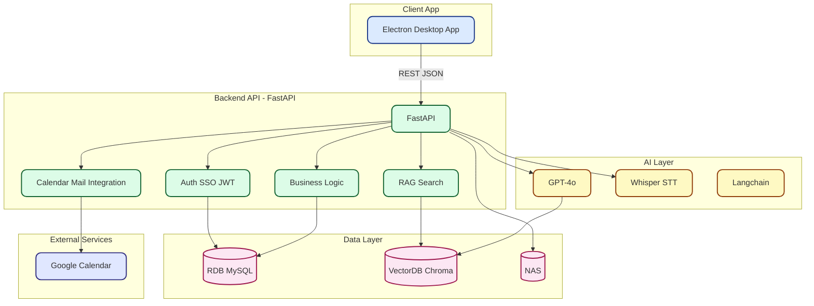

```mermaid
flowchart TB
  %% --- 노드 정의 ---
  subgraph Client["Client App"]
    A["Electron Desktop App"]
  end

  subgraph API["Backend API - FastAPI"]
    B["FastAPI"]
    B1["Auth SSO JWT"]
    B2["Business Logic"]
    B3["RAG Search"]
    B4["Calendar Mail Integration"]
  end

  subgraph AI["AI Layer"]
    C1["GPT-4o"]
    C2["Whisper STT"]
    C3["Langchain"]
  end

  subgraph Data["Data Layer"]
    D1[("RDB MySQL")]
    D2[("VectorDB Chroma")]
    D3[("NAS")]
  end

  subgraph External["External Services"]
    E1["Google Calendar"]
  end

  %% --- 연결 ---
  A -->|REST JSON| B
  B --> B1
  B --> B2
  B --> B3
  B --> B4
  B1 --> D1
  B2 --> D1
  B3 --> D2
  B --> D3
  B --> C1
  B --> C2
  C1 --> D2
  B4 --> E1
 

  %% --- 스타일 정의 ---
  classDef client fill:#DBEAFE,stroke:#1E3A8A,stroke-width:2px,rx:10px,ry:10px
  classDef backend fill:#DCFCE7,stroke:#166534,stroke-width:2px,rx:10px,ry:10px
  classDef ai fill:#FEF9C3,stroke:#92400E,stroke-width:2px,rx:10px,ry:10px
  classDef data fill:#FCE7F3,stroke:#9D174D,stroke-width:2px,rx:10px,ry:10px
  classDef external fill:#E0E7FF,stroke:#312E81,stroke-width:2px,rx:10px,ry:10px

  %% --- 클래스 적용 ---
  class A,A1,A2,A3,A4 client
  class B,B1,B2,B3,B4 backend
  class C1,C2,C3 ai
  class D1,D2,D3 data
  class E1,E2 external
```